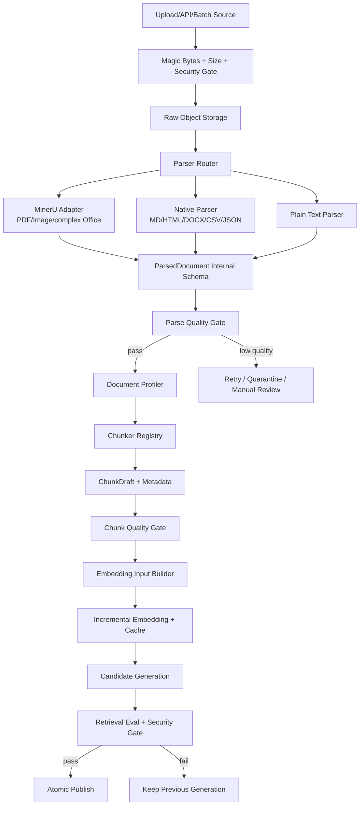

# MindBridge RAG 数据预处理与多类型文档优化技术方案

> 文档状态：Draft for Implementation  
> 编制日期：2026-08-27  
> 适用仓库：`mindbridge-py`  
> 说明：本文将需求中的“OKR”按“OCR”理解。MinerU 本身已经包含版面分析、文本识别、表格/公式解析等能力，第一阶段不再额外叠加一套 OCR 引擎。

## 1. 执行摘要

当前项目在混合检索、重排、Agentic 重检索、评测、索引代际、权限隔离和发布回滚方面已经相对完整，但数据进入索引之前仍采用一条较弱的通用路径：

```text
PDF -> pypdf 提取纯文本
其他文件 -> UTF-8 decode
全部文档 -> 空白压平 -> 512 字符固定滑窗（overlap=64）
-> 原始 chunk 直接生成 embedding
```

这会造成四类问题：

1. 扫描 PDF、双栏 PDF、表格、公式、图片标题和阅读顺序容易丢失或错乱。
2. 标题层级、页码、章节路径等结构信号没有进入 chunk 与索引。
3. FAQ、制度条款、SOP、表格、代码等内容被相同规则切分，语义边界经常被截断。
4. 现有评测主要比较 Retriever 变体，无法单独回答“解析、切块和 embedding 输入改造各自贡献了多少”。

本方案建议把主链升级为：

```text
原始二进制文档
-> 类型识别与安全检查
-> Parser Router
-> MinerU / 原生结构解析器 / 纯文本解析器
-> 统一 ParsedDocument 块模型
-> 解析质量门禁
-> Document Profile 路由
-> 差异化 Chunker
-> Chunk 质量门禁
-> EmbeddingInputBuilder
-> 增量 Embedding
-> Candidate Generation
-> 离线评测与 Shadow 验证
-> 原子发布
```

核心策略不是“一律使用更大的模型”，而是先保住文档结构，再让切块与 embedding 输入适配内容功能，并用消融实验决定最终配置。

## 2. 当前实现审计与差距

### 2.1 已有能力，应直接复用

| 能力 | 当前实现 | 本次处理方式 |
|---|---|---|
| 异步索引状态机 | `app/services/index_pipeline.py` | 保留并扩展 PARSED/CHUNKED 的真实语义 |
| 原文对象存储 | `app/services/object_storage.py` | 从“规范化文本”升级为“原始二进制 + 解析产物” |
| 增量 Diff 与稳定身份 | `app/services/chunk_diff.py`、三张 chunk/revision 关联表 | 扩展为结构感知 logical key |
| Embedding Provider | `app/services/embedding_provider.py` | 保留批处理、缓存、远程/本地 provider |
| 生产 Embedding 守卫 | `app/services/index_pipeline.py` | 保持真实向量失败不发布候选代际 |
| OpenSearch 混合检索 | `app/services/opensearch_retrievers.py` | 增加结构化字段，不改变安全过滤主线 |
| Generation 发布/回滚 | `app/services/generation_service.py`、`index_generation.py` | 用于新解析/切块版本的 Shadow 与原子发布 |
| Retrieval Ablation | `app/rag_eval/ablation.py` | 新增 Parser/Chunker/Embedding 三层消融维度 |
| RAG 指标与安全评测 | `app/rag_eval/*` | 复用 Recall@5、MRR@5、NDCG@5、P95 和泄漏指标 |

### 2.2 主要问题定位

| 环节 | 当前行为 | 直接影响 |
|---|---|---|
| 上传入口 | PDF 在 API 中先抽取一次用于安全扫描，`ingest_file()` 中又抽取一次 | 重复解析，延迟和失败点增加 |
| 原文保存 | V2 `submit_document()` 接收 `str` 并保存 UTF-8 字节 | 无法完整保存 PDF/DOCX/图片等原始二进制 |
| PDF 解析 | `extract_pdf()` 仅使用 `pypdf.PdfReader` | 扫描件无文本；复杂版面阅读顺序和表格结构弱 |
| 文本规范化 | `chunk_text()` 用正则压平全部空白 | 标题、列表、代码、表格换行语义丢失 |
| 切块 | 所有文档统一 512 字符、64 字符重叠 | 与 embedding token 边界无关；条款/Q&A/步骤可能被切断 |
| Chunk 元数据 | V2 模型已有 `section_path`，但主链传入 `None` | 结构字段存在却没有真正使用 |
| Embedding 内容 | `content` 直接送入 embedding | 缺少文档标题、章节 breadcrumb、内容类型等检索提示 |
| 质量门禁 | 主要校验 chunk/embedding 数量和代际完整性 | 解析乱码、重复页眉、空表格也可能被成功发布 |
| 评测 | Retriever 对照较完整 | 无法归因 Parser、Chunker、Embedding Input 的增益 |

## 3. 建设目标与非目标

### 3.1 建设目标

1. PDF 默认进入 MinerU 结构化解析链，支持扫描件 OCR、复杂版面、表格和公式。
2. 支持 PDF、Markdown、TXT、HTML、DOCX、PPTX、XLSX/CSV、JSON 和常见图片的统一摄取契约。
3. 将文档解析为稳定的内部块模型，业务逻辑不直接依赖 MinerU 原始 JSON。
4. 根据文档功能选择切块策略，默认使用 token 预算而非字符数预算。
5. 分离 `display_content` 与 `embedding_text`，把标题和章节路径安全地加入向量输入。
6. 保留现有增量索引、租户/密级隔离、候选代际验证和原子回滚能力。
7. 建立 Parser/Chunker/Embedding 消融实验，所有简历指标来自固定数据集的真实结果。

### 3.2 非目标

1. 第一阶段不自研 OCR 模型，也不训练 embedding 模型。
2. 第一阶段不直接引入 LLM 语义切块，避免成本、不可复现性和注入风险。
3. 第一阶段不把所有图片生成视觉 embedding；图片先以 OCR 文本、标题和说明参与检索。
4. 不同时重构 Retriever 与 Agent 主线。本阶段只调整索引输入，并复用现有检索评测。
5. 不预先承诺 Recall 提升值；目标阈值和实测结果必须分开记录。

## 4. 总体架构



设计原则：

- 原始文件、解析产物、chunk、embedding 分层存储，各层都有版本号和 hash。
- Parser、Chunker、Embedding Input Builder 均通过注册表路由，可按配置做 A/B。
- 检索展示文本与 embedding 输入分离，引用仍回到原始页码和结构位置。
- 任何新数据面都先进入候选 Generation；质量门禁失败时继续服务上一代。

## 5. 统一数据契约

### 5.1 ParsedDocument

建议新增 `app/services/document_processing/contracts.py`：

```python
@dataclass(frozen=True)
class ParsedBlock:
    block_id: str
    block_type: str          # title/paragraph/list/table/code/equation/image/caption/qa/...
    text: str
    page_no: int | None
    bbox: tuple[float, float, float, float] | None
    section_path: tuple[str, ...]
    ordinal: int
    language: str | None
    metadata: dict[str, Any]

@dataclass(frozen=True)
class ParsedDocument:
    source_uri: str
    mime_type: str
    parser_name: str
    parser_version: str
    parse_mode: str          # native_text/ocr/hybrid
    title: str | None
    blocks: tuple[ParsedBlock, ...]
    artifact_uri: str
    quality: ParseQuality
    metadata: dict[str, Any]
```

约束：

- `block_id` 在同一解析器版本和同一原始文件内必须确定性生成。
- `text` 保留必要换行；禁止像当前 `chunk_text()` 一样全局压平空白。
- `page_no` 对 PDF/图片必须尽量保留，供引用定位与问题排查。
- `bbox` 统一到 0～1000 坐标或明确记录坐标系，不把不同 MinerU backend 的坐标直接混用。
- `metadata` 只放可序列化的结构字段，不放密钥或不必要的敏感原文副本。

### 5.2 ChunkDraft

```python
@dataclass(frozen=True)
class ChunkDraft:
    logical_key: str
    display_content: str
    embedding_text: str
    content_type: str
    section_path: tuple[str, ...]
    page_start: int | None
    page_end: int | None
    token_count: int
    parent_key: str | None
    metadata: dict[str, Any]
```

`display_content` 用于返回证据和引用，`embedding_text` 仅用于生成向量。例如：

```text
[文档] 心理危机干预手册
[章节] 第三章 > 紧急处置 > 联系人升级
[类型] 操作流程
发生高风险事件时，值班人员应……
```

不能把模板前缀显示为原文，也不能让前缀改变引用正文。

### 5.3 版本与 Hash

建议明确以下维度：

```text
raw_checksum       = hash(原始二进制)
parser_fingerprint = parser_name + parser_version + options
parsed_hash        = hash(规范化 ParsedDocument)
chunker_fingerprint= profile + strategy + tokenizer + limits + version
chunk_hash         = hash(display_content + structure metadata)
embedding_hash     = hash(model + dimensions + input_builder_version + embedding_text)
```

只要 parser、chunker、输入构造或 embedding 模型发生变化，就构建新 Generation，禁止在同一物理索引中混用不可比较向量。

## 6. 文档解析方案

### 6.1 Parser Router

路由顺序：

1. 用 magic bytes 判定真实类型，扩展名只作为辅助信号。
2. 执行大小、压缩炸弹、路径遍历、MIME 伪装等上传安全检查。
3. 按格式选择解析器；PDF/图片默认使用 MinerU，文本型格式使用轻量原生解析器。
4. 解析后再次执行知识污染与 prompt injection 扫描；不能只扫描文件名或二进制。
5. 解析质量低于阈值时重试另一 backend，仍失败则隔离，不直接发布。

建议初始路由表：

| 输入 | 首选解析器 | 备用路径 | 主要保留结构 |
|---|---|---|---|
| PDF | MinerU Adapter | `pypdf` 仅限简单数字 PDF 且通过质量门禁 | 页码、标题、段落、表格、公式、图片说明、阅读顺序 |
| PNG/JPG/TIFF | MinerU OCR | 隔离/人工复核 | OCR 文本、版面、bbox |
| Markdown | Markdown AST Parser | PlainText Parser | 标题层级、列表、代码块、表格 |
| HTML | DOM Main Content Parser | PlainText Parser | heading、paragraph、list、table、code |
| DOCX | 原生 DOCX Parser 或 MinerU | MinerU/隔离 | heading、paragraph、table、list |
| PPTX | MinerU/原生 PPTX Parser | 隔离 | slide、title、textbox、notes、table |
| XLSX/CSV | 结构化表格 Parser | PlainText 只作为显式降级 | sheet、header、row group、cell type |
| JSON | Schema-aware JSON Parser | PlainText | object path、record、key/value |
| TXT/日志 | PlainText Parser | 无 | 行、段落、时间窗口 |

### 6.2 MinerU 集成方式

推荐以独立服务接入，而非加入主应用 `requirements.txt`：

```text
mindbridge-api / index-worker
        |
        | HTTP async task
        v
mineru-api / mineru-router
        |
        v
Parsed artifacts: markdown + content_list/middle JSON + images
```

理由：

- MinerU 包含模型和较重依赖，资源模型与主 API 不同。
- 官方提供 FastAPI 的异步 `POST /tasks`、任务查询和结果获取接口，适合接入现有 IndexJob worker。
- 独立服务便于设置并发、超时、熔断、GPU/CPU 资源和独立扩缩容。
- MinerU 官方结构化输出在不同 backend/版本间存在差异，因此必须用 Adapter 转成项目自有模型。

接入约束：

- 固定 MinerU 镜像/依赖版本，升级时跑解析回归集。
- 保存 `parser_name/parser_version/backend/options`，确保问题可重放。
- 生产优先异步任务；同步接口只用于本地 smoke test。
- 本地无 GPU 时可使用 pipeline/CPU 或远程 MinerU 服务，但必须单独记录解析延迟。
- `content_list_v2.json` 在官方文档中仍标注为 development version；可由适配层优先读取，但内部契约不得直接照搬。

MinerU 官方资料：

- [MinerU 官方仓库](https://github.com/opendatalab/MinerU)
- [MinerU Quick Usage 与异步 API](https://github.com/opendatalab/MinerU/blob/master/docs/en/usage/quick_usage.md)
- [MinerU 输出文件格式](https://opendatalab.github.io/MinerU/reference/output_files/)

### 6.3 OCR 策略

第一阶段使用 MinerU 的自动检测/混合解析能力：

1. PDF 先记录页数、可提取字符数、图片占比等快速探针。
2. MinerU 自动或显式选择 native/OCR/hybrid 模式。
3. 解析结果记录 `parse_mode`，便于按 OCR 与数字 PDF 分组评测。
4. 对低质量页做页级重试，而不是整份文档无限重跑。
5. OCR 文本仍要进入同一语义切块器，不能简单“一页一个 chunk”。

只有真实 PDF 回归集证明 MinerU 的 OCR 在特定场景不足时，才在第二阶段评估 PaddleOCR 等备用 Provider。两套 OCR 同时上线会扩大部署和排障面，不适合作为快速优化的第一步。

### 6.4 解析质量门禁

建议计算：

| 指标 | 说明 | 初始处理策略 |
|---|---|---|
| `non_empty_page_ratio` | 非空页占比 | 过低时 OCR/hybrid 重试 |
| `text_char_count` | 总有效字符数 | 多页但字符极少视为异常 |
| `replacement_char_ratio` | `�` 等异常字符占比 | 超阈值隔离 |
| `repeated_margin_ratio` | 重复页眉页脚占比 | 清理并告警 |
| `reading_order_anomaly` | 短行交错、断裂段落等启发式 | 复杂版面重试 |
| `table_parse_valid_ratio` | 表格行列是否稳定 | 失败表格转图片说明或隔离 |
| `ocr_confidence` | backend 可提供时使用 | 低置信页进入复核 |
| `parse_latency_ms` | 解析耗时 | 用于容量与 P95 门禁，不代表质量 |

门禁结果：`PASS`、`DEGRADED`、`QUARANTINE`。`DEGRADED` 是否可发布由环境配置决定，生产默认不自动发布低质量解析。

## 7. 差异化切块方案

### 7.1 Document Profile

格式不等于功能。PDF 可能是制度、论文、FAQ 或扫描表格，因此路由应使用 `DocumentProfile`：

```text
narrative       连续说明性文本
policy          制度、法规、条款
faq             问答、客服知识
procedure       SOP、操作手册、应急流程
table_records   报表、清单、结构化记录
code            源码、配置、API 示例
case_dialogue   工单、案例、对话、时间线
academic        论文、研究报告
```

Profile 来源按优先级排序：

1. 上传时显式指定，可信度最高。
2. 知识空间/目录配置。
3. 确定性结构规则自动识别，如连续“第 X 条”、大量 Q/A 标记或表格占比。
4. 无法判断时回退 `narrative`，不在主链调用 LLM 分类。

### 7.2 统一规则

- 长度使用 embedding tokenizer 的 token 数；没有精确 tokenizer 时使用统一估算器并记录版本。
- 首先尊重语义边界，其次才满足目标长度。
- 不跨一级标题、条款、Q/A、表格、代码符号等强边界合并。
- 小块可在同一父章节内向相邻块合并，不能无条件跨章节。
- 重叠只用于连续叙述文本；FAQ、条款、表格和代码默认不做机械 overlap。
- 标题 breadcrumb 写入 `embedding_text` 和 metadata，不重复污染 `display_content`。
- 每个 chunk 必须可映射到页码/段落/表格/记录位置。

### 7.3 策略矩阵

以下是初始实验参数，不是最终结论；最终值由固定语料消融决定。

| Profile / 内容类型 | 原子边界 | 目标 token | 最大 token | overlap | 特殊处理 |
|---|---|---:|---:|---:|---|
| Narrative / Markdown | heading、paragraph | 350～550 | 700 | 50～80 | 同章节小段合并，保留 breadcrumb |
| Policy | article/clause/item | 180～400 | 550 | 0 | 不跨条款；短子项附带父条款上下文 |
| FAQ | question + answer | 80～350 | 500 | 0 | 一组 Q/A 一个或多个语义完整块，问题进入 embedding 前缀 |
| Procedure | step group | 220～450 | 600 | 0～40 | 前置条件、警告和相关步骤不能拆散 |
| Table | header + row group | 150～450 | 600 | 0 | 每块重复表头；保存 table_id 和行范围 |
| Code | class/function/config section | 200～500 | 700 | 20～50 | 保留签名、注释、语言；不在字符串中间切 |
| Case/Dialogue | event/topic/time window | 250～500 | 650 | 30～60 | 保留角色、时间、事件顺序，敏感字段先脱敏 |
| Academic | section/subsection/paragraph | 350～600 | 750 | 50～80 | 摘要、正文、图表标题独立；参考文献降权或单独索引 |
| Fallback | sentence/paragraph | 350～500 | 650 | 50～70 | token 滑窗只作为最后兜底 |

### 7.4 关键 Chunker 行为

#### 制度/法规

```text
第十条 风险报告
（一）发现高风险信号后……
（二）值班人员应在 10 分钟内……
```

- 优先按“条/款/项”解析。
- 子项过短时，把“第十条 风险报告”作为 parent context 写入 embedding 输入。
- 不把第十条末尾与第十一条开头放入同一 chunk。

#### FAQ

```text
Q: 退款多久到账？
A: 原路退回通常需要……
```

- 问题和答案不可分离。
- 同义问法可作为 `aliases` metadata，不在第一阶段用 LLM 扩写。
- 超长答案按答案内部小标题切分，每块都携带原问题。

#### 表格

- 表头必须在每个 row-group chunk 中重复，避免只有值没有字段含义。
- 单行过宽时按逻辑列组拆分，并保留主键列。
- 大表格优先生成“sheet/table summary chunk + row group chunks”，summary 使用确定性结构摘要，不臆造结论。
- 检索返回时可以合并相邻 row group，但引用仍指向原行范围。

#### 代码/API 文档

- Markdown fenced code 与解释段落保持关联。
- Python 可按 AST 的 module/class/function 切分；JSON/YAML 按顶层 key 切分。
- 超长函数在语句块边界继续切分，保留函数签名。

### 7.5 Parent-Child 扩展

快速版本先实现单层 Chunk。后续若评测显示“小块召回高但生成上下文不足”，再启用 Small-to-Big：

```text
child chunk（用于检索/embedding，约 150～350 token）
        -> parent section（用于补充生成上下文，约 600～1200 token）
```

必须为 parent 设置独立 token 预算和 ACL 复核，不能因为 child 命中而绕过 parent 的安全检查。

## 8. Embedding 策略

### 8.1 第一优先级：优化输入而非立即换模型

保留当前 `text-embedding-3-small` 作为基线，先测试：

```text
E0: 当前固定字符 chunk + raw content
E1: 结构感知 chunk + raw content
E2: 结构感知 chunk + title/breadcrumb/content_type 前缀
E3: E2 + 候选 embedding 模型
```

这样能分离“切块增益”和“模型增益”，否则更换模型后无法归因。

### 8.2 EmbeddingInputBuilder

新增 provider-aware 输入构造器：

```python
class EmbeddingInputBuilder(Protocol):
    version: str
    def build_document(self, chunk: ChunkDraft) -> str: ...
    def build_query(self, query: str, *, domain: str | None) -> str: ...
```

原则：

- 标题、章节路径和内容类型加入文档向量输入。
- 查询指令仅在模型官方明确要求时添加，不能对所有 provider 盲目加同一前缀。
- 表格使用“表名 + 字段名 + 行记录”，而不是只 embedding HTML 标签。
- FAQ 使用“问题 + 答案”；代码使用“符号名 + 签名 + 注释 + 代码”。
- 对前缀设置 token 上限，避免结构信息挤占正文。

### 8.3 模型候选

| 方案 | 定位 | 注意事项 |
|---|---|---|
| 当前 `text-embedding-3-small` | 基线与低改造成本方案 | 保持现有 1536 维索引配置 |
| `BAAI/bge-m3` dense | 本地/私有部署候选，适合中英混合实验 | 官方模型为 1024 维；需新物理索引，不得与 1536 维向量混用 |
| 其他 provider | 仅在真实语料评测后考虑 | 必须记录模型、维度、归一化、输入模板和成本 |

BGE-M3 官方资料显示其支持 dense、sparse 与 multi-vector；本项目第一轮只比较 dense，避免与现有 BM25/RRF 同时改变多个变量：[BGE-M3 官方模型卡](https://huggingface.co/BAAI/bge-m3)。

### 8.4 缓存与增量更新

现有 Embedding Cache 应将 key 从：

```text
model + text
```

升级为：

```text
provider + model + dimensions + normalized_flag
+ input_builder_version + embedding_text_hash
```

同时保留以下不变量：

- 只对新增或内容/embedding 输入发生变化的 revision 重新计算。
- 任一批向量数量或维度不匹配，候选代际失败。
- 生产环境绝不以确定性 hash 向量替代真实 embedding。
- 模型切换通过新 Generation 完成，回滚只切 alias，不在线重算。

### 8.5 多向量策略

第一阶段每个 chunk 仍只保存一个 dense vector。第二阶段可只针对以下场景测试多向量：

- FAQ：question vector + answer vector。
- 表格：table summary vector + row-group vector。
- 图片/图表：caption/OCR vector + 视觉描述 vector。

只有在 Recall/NDCG 增益显著且存储、延迟可接受时才上线，避免为简历展示堆叠未验证复杂度。

## 9. 存储与索引字段调整

### 9.1 数据库

建议新增或扩展：

`knowledge_document_versions`：

```text
mime_type
raw_checksum
parser_name
parser_version
parser_options_hash
parse_mode
parse_artifact_uri
parse_quality_json
document_profile
chunker_version
embedding_input_version
embedding_model
```

`chunk_revisions` 或等价 metadata 表：

```text
display_content
embedding_text_hash
content_type
token_count
page_start/page_end
metadata_json
```

`knowledge_document_chunks` 已有 `section_path`，应真正写入；`logical_chunk_key` 建议使用：

```text
document_id : section_anchor : content_type : local_ordinal
```

Diff 时先按 logical key，再按内容 hash 和邻近顺序匹配 moved/modified，降低前文插入导致全量重算的概率。

### 9.2 OpenSearch

建议物理索引增加：

```text
title                 text + keyword
section_path          text + keyword
content_type          keyword
document_profile      keyword
page_start/page_end   integer
parent_key            keyword
parser_version        keyword
chunker_version       keyword
embedding_model       keyword
token_count           integer
parse_quality_level   keyword
```

安全字段 `organization_id/workspace_id/knowledge_space_id/classification_level/generation_id` 保持服务端 filter 和应用层二次复核，不因新 metadata 改变安全边界。

## 10. 评测设计

### 10.1 数据集分层

建立 `data/eval/ingestion/`：

```text
manifest.jsonl
documents/
  born-digital-pdf/
  scanned-pdf/
  multi-column-pdf/
  table-heavy/
  policy/
  faq/
  procedure/
  markdown-html/
  spreadsheet/
gold/
  parse-blocks.jsonl
  retrieval-cases.jsonl
```

最小可用集建议 30～50 份文档、120～200 个查询，覆盖中文为主、中英混合、扫描件、表格、条款、FAQ 与多跳问题。可先用 12～15 份文档做 smoke，再扩到正式集。

### 10.2 指标

解析层：

- 文本字符准确率或 normalized edit similarity。
- 标题/段落/列表/表格 block F1。
- 阅读顺序正确率。
- 页码定位准确率。
- 表格单元格准确率或 row/column structure accuracy。
- 空页率、乱码率、重复页眉页脚率。
- 单页/单文档解析 P50/P95 与失败率。

切块层：

- Boundary Precision/Recall：是否在金标语义边界切分。
- Oversized/Undersized chunk ratio。
- Context completeness：答案所需事实是否落在同一块或可控相邻块中。
- Duplicate token ratio：overlap 带来的重复索引成本。
- 平均/分位 token 数和每文档 chunk 数。

检索层：

- Candidate Recall@50。
- Recall@5、MRR@5、NDCG@5、HitRate@5。
- 按 `format/profile/parse_mode` 分组，而不是只看总平均。
- Retrieval P95 与索引体积。

端到端：

- Faithfulness、Groundedness、Citation Accuracy。
- OCR/表格问题单独统计 answer correctness。
- 跨租户、越权密级、跨 Generation 泄漏必须为 0。

### 10.3 消融矩阵

| 实验 | Parser | Chunker | Embedding Input | Model | 目的 |
|---|---|---|---|---|---|
| D0 | pypdf/plain | char-512 | raw | current | 现状基线 |
| D1 | MinerU/native | char-512 | raw | current | 仅测解析增益 |
| D2 | MinerU/native | profile-aware | raw | current | 仅测切块增益 |
| D3 | MinerU/native | profile-aware | structured prefix | current | 测输入构造增益 |
| D4 | MinerU/native | profile-aware | structured prefix | candidate | 测模型增益 |

同一实验必须固定 query、gold、top-k、candidate-k、reranker 和安全过滤。报告同时给出质量、延迟、索引体积和成本，不能只挑最高 Recall。

### 10.4 建议发布门槛

以下为初始目标，跑出基线后可调整：

- 解析失败率不高于当前基线，扫描 PDF 非空页率显著改善。
- 正式评测集 Recall@5、MRR@5、NDCG@5 不得回退超过 1 个百分点。
- 目标 profile（PDF/OCR、policy、FAQ、table）至少两个分组有统计可信的改善。
- 跨租户、越权密级和跨 Generation 泄漏为 0。
- 新索引 chunk/embedding 数一致，向量维度一致，解析低质量文档不自动发布。
- P95 和存储增长在预设预算内；若质量提高但成本过高，保留为可选高精度策略。

## 11. 可观测性、可靠性与安全

### 11.1 Metrics

建议新增：

```text
rag_parse_jobs_total{parser,mode,status,mime}
rag_parse_latency_ms{parser,mode,mime}
rag_parse_quality_score{metric,mime}
rag_chunk_count{profile,strategy}
rag_chunk_tokens{profile,strategy}
rag_chunk_duplicate_ratio{strategy}
rag_embedding_input_tokens{model,profile}
rag_embedding_reuse_ratio{model,input_version}
rag_ingest_stage_failures_total{stage,error_class}
rag_ingest_quarantine_total{reason}
```

Trace 中记录 `document_version_id/parser_fingerprint/chunker_fingerprint/embedding_model/generation_id`，不记录超出排障需要的敏感正文。

### 11.2 失败与降级

| 故障 | 行为 |
|---|---|
| MinerU 超时/限流 | 指数退避；保持 IndexJob lease；达到上限后隔离 |
| MinerU 不可用 | 简单数字 PDF 可按配置走 pypdf + 质量门禁；复杂/扫描 PDF 不静默降级发布 |
| 解析质量低 | 页级重试或 QUARANTINE |
| Chunker 异常 | 不生成候选代际，不影响当前 serving alias |
| Embedding 失败/维度错 | 沿用现有 fail-closed 规则，候选代际不发布 |
| 新策略检索回退 | Gate 失败，保留上一 Generation |

### 11.3 安全

- 原始文件在解析前做文件安全检查，解析后文本再做知识污染检查。
- MinerU 服务放在受控网络，不允许任意外部 URL 抓取；优先使用对象存储签名 URL 或文件流。
- 对象存储沿用 workspace 隔离，解析产物继承原文的 classification/ACL。
- 解析图片和临时文件设置 TTL，避免敏感材料长期散落在 worker 本地目录。
- 日志只记录 hash、版本、页码、质量分，不默认记录正文和 OCR 全文。
- 表格、对话和案例中的个人信息在进入 embedding 前按现有 DLP 策略处理。

## 12. 配置与 Feature Flags

建议新增：

```text
DOCUMENT_PROCESSING_V2_ENABLED=false
DOCUMENT_PARSER_DEFAULT=native
PDF_PARSER=mineru
MINERU_BASE_URL=http://mineru:8000
MINERU_BACKEND=auto
MINERU_TIMEOUT_SECONDS=300
MINERU_MAX_CONCURRENCY=2
MINERU_FALLBACK_POLICY=quality_gated_pypdf
PARSE_QUALITY_GATE_MODE=observe
DOCUMENT_PROFILE_MODE=auto
CHUNKER_STRATEGY_VERSION=v2
CHUNK_TARGET_TOKENS=450
CHUNK_MAX_TOKENS=700
EMBEDDING_INPUT_VERSION=v2
INGESTION_SHADOW_ENABLED=false
```

开发环境先 `observe/shadow`，生产候选 Generation 通过门禁后再逐步启用。

## 13. 关键技术决策

| 决策 | 结论 | 原因 |
|---|---|---|
| MinerU 如何部署 | 独立服务/sidecar，不进入主 API Python 依赖 | 资源隔离、升级隔离、便于异步和限流 |
| 是否再加独立 OCR | 第一阶段不加 | MinerU 已覆盖 OCR，先用数据证明缺口 |
| 是否全用 LLM 语义切块 | 不使用 | 成本高、不可复现、存在注入与稳定性问题 |
| 长度单位 | token | 与 embedding/context 预算一致 |
| 是否立即换 embedding | 否，先保留当前模型做分层消融 | 能正确归因解析与切块增益 |
| MinerU 原始 Schema | 只在 Adapter 内使用 | 官方不同 backend/版本输出存在差异 |
| PDF 降级 | 质量门禁控制，不静默发布 | 防止“任务成功但知识被破坏” |
| 发布方式 | Candidate Generation + Shadow + alias 原子切换 | 复用现有可回滚能力 |

## 14. 预期项目价值与简历表达

完成后，项目亮点将从“实现混合检索和 Agentic RAG”扩展为完整数据链路：

```text
多格式文档摄取
+ MinerU/OCR 复杂 PDF 解析
+ 结构化、差异化切块
+ 增量 Embedding 与版本化输入
+ 数据质量门禁
+ 端到端消融评测
+ Generation 原子发布/回滚
```

简历只能引用实测报告。例如最终可按真实结果表述：

> 设计并实现面向 PDF/扫描件、制度、FAQ 和表格的结构感知 RAG 摄取流水线，接入 MinerU/OCR、差异化 token 切块与增量 embedding；通过固定金标集和消融实验验证 Recall@5、NDCG@5、解析 P95 与索引成本，并以 Generation alias 实现无停机发布与回滚。

任何“提升 X%”“P95 为 X ms”都必须来自后续 `target/rag-ingestion-benchmark/` 的真实产物。

## 15. 推荐落地范围

为了快速形成可展示成果，首个可发布版本只做：

1. 原始二进制摄取与统一 Parser 接口。
2. MinerU PDF/图片适配，保留页码、标题、段落、表格。
3. Markdown/TXT 原生解析。
4. `narrative/policy/faq/procedure/table` 五类 Chunker。
5. token 预算与结构化 embedding 输入。
6. D0～D3 消融、按文档类型分组报告、候选代际发布。

DOCX/PPTX/XLSX 深度解析、多向量和视觉 embedding 放在第二阶段，避免第一次迭代范围失控。
