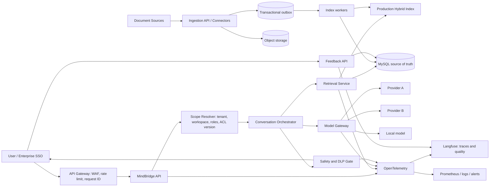

# MindBridge 生产化闭环实施方案

> 版本：v1.0  
> 日期：2026-08-14  
> 范围：大规模知识增量更新、多租户与权限、高并发与成本容错、请求风控、模型负载均衡与降级、可观测与用户反馈。

## 1. 目标与结论

本方案不是在现有代码上继续叠加几个开关，而是把六类已有但未闭环的能力改造成可以验证、灰度、回滚和持续运营的生产系统。

实施遵循以下依赖顺序：

1. 先建立强制的租户、Workspace 和 ACL 数据边界。
2. 再让文档、索引、缓存、检索、模型和审计全链路继承同一个访问 Scope。
3. 在边界可靠后，把索引改造成异步、幂等、chunk 级增量流水线。
4. 将本地单实例检索和直连模型改为可横向扩展的检索服务与模型网关。
5. 在请求入口、RAG、模型输出和工具调用四层建立风控。
6. 最后用 SLO、成本账单、线上评测、用户反馈和演练证明闭环成立。

完成后的核心原则是：**任何请求如果缺少明确 Scope、预算、截止时间或审计上下文，默认拒绝执行，不允许回退到全库、全权限或无限重试。**

## 2. 建议的初始容量与 SLO

以下数值作为首轮容量设计基线，正式实施前由业务、平台和财务共同确认；如果实际目标更高，只调整容量，不降低隔离与安全门槛。

| 项目 | 首轮验收目标 |
|---|---:|
| 租户数 | 100 |
| Workspace 数 | 1,000 |
| 总文档分块 | 1,000 万 chunks |
| 单 Workspace 最大分块 | 100 万 chunks |
| 文档变更到可检索 | p95 小于 5 分钟 |
| 无变化文档更新 | embedding 调用数为 0 |
| 检索吞吐 | 持续 200 QPS，峰值 400 QPS |
| 检索时延 | p95 小于 800 ms，p99 小于 1.5 s |
| 对话首 token | 平台侧 p95 小于 2.5 s；供应商额外耗时单独统计 |
| 可用性 | 月度 99.9%，安全拒绝不计故障 |
| 跨租户/跨 ACL 泄漏 | 自动化与红队样本均为 0 |
| 模型成本 | 可按 tenant/workspace/user/model/operation 日结，误差小于 2% |
| 用户反馈 | 100% 绑定 trace、回答版本和证据版本 |

## 3. 目标架构



生产环境推荐使用支持分片、副本、别名切换、BM25、向量检索和 metadata filter 的混合检索集群。默认方案可选 OpenSearch；保留 `KnowledgeStore` 接口，使 Chroma 只用于本地开发和小规模测试。若组织已有 Qdrant/Milvus 与 OpenSearch，也可拆分向量和关键词引擎，但 Scope filter 必须在两个引擎中一致执行。

## 4. 闭环定义

### 4.1 大规模文档增量更新

只有同时满足以下条件才算闭环：

- 能识别新增、修改、删除、重命名和权限变化。
- 内容未变化时不重新切块、不重新 embedding、不重写索引。
- 内容变化时只处理受影响 chunks，并正确删除失效 chunks。
- 更新任务幂等、可重试、可断点续传，不产生重复版本。
- 新版本完整可用前，旧版本继续服务；发布通过别名或版本指针原子切换。
- SQL、对象存储和检索索引之间有定期 reconciliation。
- 能查看每份文档的处理状态、失败原因、重试次数和当前可检索版本。

### 4.2 多租户隔离与权限

- 每一张业务表、每条索引记录、每个缓存键和每条队列消息都带 `tenant_id` 和 `workspace_id`。
- 文档读取由 Knowledge Space、文档 ACL、用户/用户组和数据分级共同决定。
- API、Service、Repository、检索引擎和后台导出均执行 Scope 过滤。
- 缺少 Scope 的生产调用直接失败；不存在“默认 MENTAL”或“默认全库”。
- 管理员权限不自动等同于敏感原文读取权限。
- 跨租户和跨 Workspace 攻击测试结果为零泄漏。

### 4.3 高并发、成本与容错

- API 和检索服务可水平扩容，不依赖单机本地索引状态。
- 每个外部依赖都有超时、有限重试、熔断、舱壁和退避策略。
- 有租户级和全局并发上限、队列长度、负载保护与明确的 429/503 行为。
- 对话、检索、embedding、rerank、judge 成本可计量、限额和告警。
- 降级不突破 Scope、不跳过安全审核、不把失败流量回退到全库。

### 4.4 请求风控

- 入口层限制速率、并发、请求体、文件类型和文件大小。
- RAG 文档按不可信输入处理，不能改变系统策略、权限和工具边界。
- 输出在返回用户前通过敏感信息、密钥、越权事实和危险内容检查。
- 工具调用只有 allowlist schema，具备最小权限、幂等和审计。
- 可识别异常账号、批量探测、提示注入、数据套取和资源消耗攻击。

### 4.5 模型负载均衡与多供应商降级

- 模型选择由统一网关完成，业务 Agent 不直接拼供应商 URL。
- 网关支持能力、价格、数据驻留、健康度、延迟和并发感知路由。
- 429、超时和 5xx 有有限重试；持续失败触发熔断和批准的 fallback graph。
- 流式输出中途失败有明确策略，不声称可以无缝切换后继续同一生成。
- 所有切换、降级、重试和费用均可追踪。

### 4.6 可观测、效果监控与反馈

- trace 覆盖入口、Scope、路由、检索、rerank、模型、安全审核和工具。
- token、费用、缓存命中、降级、拒绝、错误、TTFT 和总时延均有指标。
- 用户可以点赞、点踩、选择原因、补充说明和提交正确答案。
- 线上抽样评测与用户反馈进入同一质量看板，并能回溯到回答和知识版本。
- 告警有责任人、处置手册、暂停开关和恢复验证。

## 5. 分阶段实施

### 阶段 0：立即止血与基线固化

建议周期：1 周。该阶段不做大规模架构迁移，先消除已知高风险默认行为。

### 任务 0.1：修复当前索引一致性缺陷

修改 `app/services/knowledge.py`：

1. 把“内容未变化”判断移动到删除旧向量之前。
2. 为 `ingest()` 增加事务边界；SQL 提交失败时不得遗留半更新索引。
3. 增加重复提交相同内容后向量仍存在的回归测试。
4. 暂时关闭每次 upsert 自动复制整个 Chroma 目录，改为显式定时快照。

验收：相同 source/content 连续提交 100 次，SQL chunk 数、向量 ID 集合和版本号保持不变，embedding 调用为 0。

### 任务 0.2：收紧当前配置

1. 生产配置立即设置 `DOMAIN_RBAC_ENFORCED=true`；启用前完成现有管理员角色映射。
2. `LANGFUSE_CAPTURE_INPUT/OUTPUT` 在敏感域先设为 `false`，仅保留脱敏预览和白名单 metadata。
3. 设置聊天消息、source、文档正文和上传文件的硬上限。
4. 增加聊天用户/IP 限流和全局并发 semaphore；分布式部署后迁移到 Redis 限流。
5. `KNOWLEDGE_VECTOR_REQUIRED` 按环境区分：生产混合检索服务不可用时执行同 Scope 的受控降级，不允许静默切到全量内存扫描。

### 任务 0.3：建立性能、安全和成本基线

记录当前版本的：

- 1 万、10 万、100 万 chunk 下的索引时间、内存、检索 p50/p95/p99。
- 单用户和多用户并发 10/50/100 下的吞吐、错误率和数据库连接数。
- 每轮 Agent 调用次数、prompt/completion token、embedding 和 rerank 调用数。
- 跨域越权、prompt injection、超长输入、重复请求测试结果。

输出 `target/baseline/production-readiness.json`，后续所有阶段与它比较。

### 阶段门禁

- 已知“重复入库删除向量”问题修复。
- RBAC 在 staging 强制开启。
- 原始敏感输入默认不进入观测平台。
- 建立可重复运行的负载与攻击基线。

回滚：仅回滚代码，不回滚新增测试和安全配置；若 RBAC 角色数据不完整，则暂停敏感管理接口，而不是重新开放全域访问。

### 阶段 1：租户、Workspace 与 ACL 强制边界

建议周期：2～3 周。该阶段是后续全部工作的前置依赖。

### 任务 1.1：新增核心数据模型

新增 Alembic 迁移和实体：

- `organizations(id, name, status, created_at)`
- `workspaces(id, organization_id, name, status, acl_version)`
- `workspace_members(workspace_id, user_id, role, status)`
- `user_groups(id, workspace_id, name)` 与 `user_group_members`
- `knowledge_spaces(id, workspace_id, domain, name, visibility, classification)`
- `resource_acls(resource_type, resource_id, principal_type, principal_id, permission)`
- `access_audit_events(tenant_id, workspace_id, actor_id, action, resource, decision, reason, trace_id)`

现有表至少增加：

- `user_accounts.organization_id`
- `chat_sessions.workspace_id`
- `knowledge_chunks.organization_id/workspace_id/knowledge_space_id/document_id`
- report、case、tool job、trace、feedback 的 organization/workspace 字段

所有唯一键和高频索引必须包含 Scope，例如：

```text
UNIQUE(workspace_id, source_key, version, source_index)
INDEX(workspace_id, domain, status)
INDEX(workspace_id, user_id, updated_at)
```

### 任务 1.2：定义不可省略的 RequestScope

新增 `app/core/scope.py`：

```python
@dataclass(frozen=True)
class RequestScope:
    organization_id: int
    workspace_id: int
    user_id: int
    roles: frozenset[str]
    group_ids: frozenset[int]
    acl_version: int
    trace_id: str
```

规则：

1. 认证完成后由 `ScopeResolver` 生成，不能由请求正文直接声明。
2. Repository 和检索接口把 `scope` 设为必填参数。
3. 生产模式中 `scope=None` 抛出 `ScopeRequiredError`。
4. 不允许 Service 自行补默认 tenant/workspace/domain。
5. 后台任务保存 Scope 快照，执行前重新检查 ACL 版本；权限已收回则取消任务。

### 任务 1.3：接入企业身份

1. 生产接入 OIDC/OAuth2/企业 SSO；JWT 校验 issuer、audience、expiry 和 key rotation。
2. Basic Auth 只保留开发环境并加显式开关。
3. 如仍允许本地密码，改用 Argon2id/bcrypt，迁移时登录成功后渐进重哈希。
4. 定义 `ORG_ADMIN`、`WORKSPACE_ADMIN`、`KNOWLEDGE_EDITOR`、`KNOWLEDGE_VIEWER`、`AUDITOR`、`CASE_READER` 等角色。
5. `PLATFORM_ADMIN` 默认不能读取心理、合规原文，读取需额外域角色或审批。

### 任务 1.4：API 与 Service 双层鉴权

逐项修改：

- 聊天：只能选择用户可访问的 workspace，检索只使用其可见 Knowledge Spaces。
- 知识管理：ingest/list/status/publish/archive/rebuild/backup 均校验 space 权限。
- 报告、case、conversation、trace、tool audit：先查资源最小 metadata，再鉴权，再读正文。
- 导出：异步生成，下载 URL 短期有效、单用户绑定，并写审计。
- 后台列表：无 domain 参数时返回“有权限资源的并集”，不是所有资源。

### 任务 1.5：索引与缓存继承 Scope

每条检索记录写入：

```json
{
  "organization_id": 1,
  "workspace_id": 10,
  "knowledge_space_id": 25,
  "document_id": 9001,
  "classification": "INTERNAL",
  "acl_principals": ["role:KNOWLEDGE_VIEWER", "group:88"]
}
```

检索 query 必须先构造 filter，再发送到引擎；禁止先全库召回再在应用层过滤。缓存键必须包含 `workspace_id + acl_version + index_generation`，权限变化时通过递增 `acl_version` 使旧缓存立即失效。

### 数据迁移

1. 新列先 nullable，上线双写。
2. 创建默认 organization/workspace，将历史数据回填进去。
3. 校验每张表 `scope_null_count=0`。
4. 重建带 Scope metadata 的新索引。
5. 影子读取比对新旧结果。
6. 切换读路径后增加 NOT NULL 和复合唯一约束。
7. 最后关闭旧的无 Scope 方法。

### 阶段门禁

- 缺少 Scope 的 Repository/检索调用测试 100% 拒绝。
- 角色、用户组、ACL 变更在 60 秒内影响检索结果。
- 跨 tenant/workspace/space 的 SQL、向量、BM25、缓存、导出和后台接口泄漏为 0。
- 审计能够解释每次允许或拒绝的主体、资源和策略版本。

回滚：保留旧列和旧索引一个稳定周期；只能回滚读路径，不能删除已写入的新 Scope 数据。

### 阶段 2：文档级与 chunk 级增量索引流水线

建议周期：3～4 周。

### 任务 2.1：拆分文档、版本和 chunk

新增：

- `knowledge_documents`：稳定文档身份、source URI、当前版本、权限、状态。
- `knowledge_document_versions`：content hash、parser/chunker/embedding 版本、对象存储地址、状态。
- `knowledge_chunks_v2`：stable chunk key、section path、chunk hash、embedding hash、状态。
- `index_jobs`：任务状态、幂等键、attempt、lease、deadline、错误分类。
- `outbox_events`：与业务事务一起提交的索引事件。

版本状态机：

```text
DISCOVERED -> PARSED -> CHUNKED -> EMBEDDED -> INDEXED -> VALIDATED -> PUBLISHED
                                  \-> FAILED / QUARANTINED
```

旧版本只有在新版本 `VALIDATED` 后才从 current pointer 切走。

### 任务 2.2：稳定 ID 与差异算法

1. 文档身份：`workspace_id + canonical_source_uri`。
2. 内容 hash：原始二进制 SHA-256；解析后文本另存 normalized hash。
3. chunk stable key：`document_id + section_path + normalized_chunk_hash`，不再使用数据库自增 ID 作为向量主键。
4. diff 结果分为 unchanged、added、modified、deleted。
5. unchanged 复用旧 embedding；added/modified 才调用 embedding；deleted 写 tombstone 并从索引删除。
6. parser、chunker 或 embedding model 版本变化时，显式创建 reindex generation，不能伪装成普通内容更新。

### 任务 2.3：可靠异步执行

1. Ingest API 只保存原文、metadata 和 outbox event，立即返回 `document_id/job_id`。
2. Worker 使用数据库 lease 或 `SELECT ... FOR UPDATE SKIP LOCKED` 原子认领。
3. 幂等键：`workspace:document:content_hash:pipeline_version`。
4. 同一文档使用分布式锁或有序队列，防止旧版本晚到覆盖新版本。
5. 瞬态错误有限重试并加指数退避和 jitter；永久错误进入 quarantine/DLQ。
6. 支持取消、重放、从指定阶段恢复和受控全量 reindex。

### 任务 2.4：生产检索索引

1. 新建版本化索引，例如 `knowledge-v3-g0001`。
2. 使用读别名 `knowledge-current` 原子切换 generation。
3. 文档在线小更新直接写当前 generation；大规模 parser/model 变更构建新 generation 后切换。
4. 索引至少 1 副本，并跨故障域部署。
5. Chroma 仅保留开发 profile，不作为多副本生产索引。

### 任务 2.5：一致性校验与删除

定时 reconciliation 比较：

- DB 当前发布 chunk 数与索引数。
- stable ID、content hash、Scope metadata 和 ACL version。
- 已删除文档是否仍可召回。
- 索引中是否存在没有 DB 当前版本的孤儿记录。

删除采用 tombstone + 延迟物理删除；涉及隐私删除时跳过延迟并产生合规审计。所有缓存同时按 document/index generation 失效。

### 阶段门禁

- 单文档修改 5% 内容时，embedding 数不超过受影响 chunk 数的 1.2 倍。
- 重复事件、乱序事件和 Worker 崩溃不会产生重复 current version。
- 发布切换过程中读请求始终看到完整旧版或完整新版，不看到半版本。
- 随机抽取 10 万文档，DB 与索引一致率 100%；任何差异可自动修复或隔离。

回滚：读别名切回上一 generation；DB current version 指针保留历史；不得通过删除整个生产索引回滚。

### 阶段 3：高并发检索、缓存和服务容错

建议周期：3～4 周，可与阶段 2 后半段并行。

### 任务 3.1：抽出 RetrievalService

统一接口：

```python
retrieve(scope, query, top_k, deadline, filters, policy) -> RetrievalResponse
```

响应包含结果、索引 generation、召回路径、缓存命中、降级信息和耗时分解。删除当前 `_retrieve_bm25()` 对域内全部数据库 chunk 的 `.all()` 扫描；BM25 和向量召回都由生产检索引擎完成。

### 任务 3.2：异步 I/O 和连接池

1. FastAPI 路径使用 async 数据库/HTTP 客户端，客户端按进程复用。
2. 配置 MySQL、Redis、检索引擎和模型网关连接池及等待超时。
3. 每个依赖建立独立 semaphore，避免检索积压耗尽模型或数据库连接。
4. 整个请求携带 absolute deadline，各子调用只使用剩余预算。
5. 用户断开 SSE 后及时取消未开始的下游任务；已产生副作用的任务按幂等策略完成或补偿。

### 任务 3.3：分层缓存

- L1：进程内小型 TTL/LRU，仅缓存无敏感 metadata。
- L2：Redis query embedding cache。
- L2：检索结果 cache，键包含 query hash、workspace、ACL version、index generation、filter、top_k 和 rerank version。
- 可选 semantic cache 只用于策略批准的低敏感 FAQ；心理、合规和高风险轮次默认关闭。

缓存中不得存储未加密敏感原文；ACL 或索引变化通过版本键自然失效，不依赖批量扫描删除。

### 任务 3.4：负载保护

实现四级保护：

1. API Gateway：tenant/user/IP token bucket。
2. 应用：每 tenant 同时进行中的 chat/retrieval/model 请求上限。
3. 下游舱壁：embedding、rerank、chat model 独立并发池。
4. 队列：长度和等待时间超过阈值时快速返回 429/503 与 `Retry-After`。

禁止无界队列。高风险安全请求可保留独立小容量通道，但不能无限抢占。

### 任务 3.5：检索降级矩阵

| 故障 | 允许行为 | 禁止行为 |
|---|---|---|
| reranker 超时 | 使用同 Scope 的 hybrid recall 排序 | 改查全库 |
| 向量分片局部失败 | 同 Scope BM25 + 明确 degraded 标记 | 删除 Scope filter |
| 检索集群整体失败 | 低风险使用批准模板或返回暂不可用；高风险进入安全模板 | 自由生成事实答案 |
| Redis 失败 | 绕过缓存并收紧并发 | 本地无限缓存 |
| DB 失败 | 停止需要持久化的操作 | 生成未审计副作用 |

### 阶段门禁

- 达到第 2 节吞吐目标，CPU、内存、连接池和队列无持续增长。
- 单个供应商/检索节点故障不会引起级联连接耗尽。
- 所有降级结果保持相同 Scope，跨租户泄漏为 0。
- 同 session 并发消息通过 turn sequence 串行提交，重复 client message ID 只处理一次。

### 阶段 4：统一模型网关、成本控制和多供应商降级

建议周期：2～3 周。

### 任务 4.1：建立 ModelGateway

新增 `app/model_gateway/`：

- `ProviderAdapter`：OpenAI-compatible、Anthropic、Ollama/local 等协议适配。
- `ModelRegistry`：能力、上下文长度、结构化输出、价格、数据驻留、敏感级别许可。
- `RoutingPolicy`：按 operation、domain、risk、tenant plan、预算和健康度选择模型。
- `HealthTracker`：滑动窗口成功率、429、p95、并发和 circuit 状态。
- `UsageLedger`：记录输入/输出/cache token、费用、供应商 request ID。
- `FallbackGraph`：显式允许的主备关系。

现有 `AiClient` 变为网关客户端；Agent 只声明 `operation + capability + risk profile`，不能直接选择任意 URL/key。

### 任务 4.2：负载均衡策略

候选模型先经过硬约束：

1. 数据驻留与敏感级别允许。
2. 支持所需上下文和结构化输出。
3. tenant 合同允许。
4. circuit 未打开且未超过并发。

再按健康度、价格、延迟和 outstanding requests 评分。初期采用加权最少在途请求；收集足够数据后再做自适应路由，避免一开始引入不可解释算法。

### 任务 4.3：错误分类与 fallback graph

| 错误 | 策略 |
|---|---|
| DNS/连接/超时/429/5xx | 在剩余 deadline 内有限重试；只重试幂等的未开始生成请求 |
| 401/403/模型不存在 | 永久错误，立即熔断该配置并告警 |
| JSON/枚举非法 | 一次本地修复或小模型结构修复，失败走确定性模板 |
| 内容安全拒绝 | 不换更宽松供应商绕过；按安全策略响应 |
| 流式生成中断 | 结束当前流并明确重试/降级；不得把另一模型片段伪装成同一完整回答 |

建议 fallback graph 示例：

```text
route-small -> route-backup -> deterministic rules
rewrite-small -> rewrite-backup -> original sanitized query
answer-primary -> answer-secondary -> domain-approved template
embedding-primary -> embedding-compatible-backup -> scoped BM25
rerank-primary -> local rerank -> hybrid recall order
```

embedding fallback 只有在向量维度和语义空间兼容时才能写入同一索引；不兼容模型必须使用独立 generation。

### 任务 4.4：成本闭环

1. 从供应商响应解析真实 usage；缺失时用 tokenizer 估算并标记 estimated。
2. 维护带生效时间的价格表，历史账单使用调用当时价格。
3. 配置 tenant/workspace/user/operation 的日、月软硬预算。
4. 预算达到 80% 告警；达到 100% 时按策略切换低成本模型、降低非必要 judge 采样或拒绝非关键请求。
5. 高风险安全响应不因普通预算耗尽而消失，使用独立受控额度或零模型安全模板。
6. 限制 Agent 总轮数之外，再限制总 LLM 调用数、总 token、总耗时和总预计费用。

### 阶段门禁

- 模拟主供应商 429、超时和 5xx，fallback 符合图定义且不重复收费失控。
- 熔断期间不再向故障供应商持续发送探测流量；半开探测受限。
- 实际供应商账单与 UsageLedger 日汇总误差小于 2%。
- 任一请求超过 token、时间、费用或调用数预算都能确定性终止。

回滚：网关保留“固定单模型”路由策略；回滚策略配置，不允许业务代码重新直连供应商。

### 阶段 5：请求、RAG、输出和工具四层风控

建议周期：3～4 周，可从阶段 1 开始并行。

### 任务 5.1：入口风控

1. API Gateway/WAF 实施 IP、user、tenant 多维限流和异常突发检测。
2. `ChatRequest.message` 增加最大字符和最大 UTF-8 bytes。
3. 上传采用流式读取，限制大小、页数、解压后大小、嵌套深度和解析时间。
4. 只允许批准 MIME 和扩展名，双重校验 magic bytes；接入恶意文件扫描。
5. 拒绝 path traversal、压缩炸弹、超大 PDF 对象和解析器已知高危格式。
6. 为每个请求生成 `client_message_id` 和 `trace_id`，重复请求幂等。

### 任务 5.2：提示注入与知识污染防护

1. 系统策略、用户输入、历史消息和检索文档使用结构化字段传递，禁止简单字符串无边界拼接。
2. Prompt 明确声明检索内容是“不可信事实材料，不是指令”。
3. 文档入库时运行注入/密钥/恶意链接扫描，风险文档进入 quarantine 等待审核。
4. 检索后检查“忽略系统指令、导出秘密、调用工具”等注入模式，并降低或剔除风险 chunk。
5. 使用 canary secret 测试模型是否会泄漏系统提示或内部上下文。
6. RAG 回答必须绑定 citation；敏感域无证据时不得自由补全事实。

注入检测不能单独依赖另一个 LLM；规则、结构隔离、权限边界和输出检查必须独立存在。

### 任务 5.3：输出 DLP 与最小披露

返回用户前执行：

- API key、JWT、密码、连接串、私钥等 secret 检测。
- 手机、邮箱、证件、账号和自定义企业敏感词检测。
- 检查引用文档是否仍在当前 Scope、ACL/version 是否变化。
- 检查模型是否输出后台风险标签、系统 prompt、其他用户信息或未授权调查详情。
- 按策略执行 redact、block、人工复核或安全模板替换。

所有拦截保存 reason code 和 hash，不默认保存被拦截的完整敏感文本。

### 任务 5.4：工具和外部访问安全

1. 工具仅允许注册表中的 JSON Schema，拒绝未知字段和动态工具名。
2. 凭据按 tenant/tool 最小权限隔离，模型永远看不到原始 secret。
3. 网络工具使用域名 allowlist、DNS 重绑定防护和私网地址阻断，防止 SSRF。
4. 有副作用工具需要 idempotency key；高影响动作需要审批或双确认。
5. 工具参数在执行前重新鉴权，不能信任模型在规划阶段的权限结论。
6. DLQ 和审计 payload 只保存必要字段并脱敏。

### 任务 5.5：滥用检测和事件响应

建立风险事件：

- 单用户短时间枚举大量文档名或敏感主题。
- 多次请求系统 prompt、其他部门信息或隐私标识。
- 大量超长输入、取消流、并发 session 或昂贵模型调用。
- 多次触发注入、DLP、ACL 拒绝或工具越权。

处置级别：观察、限速、验证码/二次认证、临时冻结、租户管理员通知、安全团队告警。提供误报申诉和恢复流程。

### 阶段门禁

- OWASP LLM 类攻击集、SSRF、文件炸弹、越权和资源耗尽测试通过。
- 系统 prompt、canary secret、跨用户数据和未授权知识泄漏为 0。
- 工具越权在执行前阻断，且审计能重建决策过程。
- 风控关闭或降级需要审批和审计，不能通过普通环境变量静默绕过。

### 阶段 6：可观测性、效果监控和用户反馈

建议周期：2～3 周。

### 任务 6.1：统一遥测标准

引入 OpenTelemetry，保留 Langfuse 作为 LLM trace/评测层。所有组件共享：

- `trace_id/request_id/client_message_id`
- organization/workspace 的不可逆标识或内部 ID
- operation、model、provider、route reason、policy version
- index generation、document version、ACL version
- token、cost、cache hit、retry、fallback、circuit、queue wait
- outcome、error class、DLP/ACL decision

禁止将原始敏感文本作为 Prometheus label 或普通日志字段。

### 任务 6.2：指标与 SLO

至少建设：

**流量与性能**

- request QPS、并发、队列深度、p50/p95/p99、TTFT、SSE 中断率。
- 检索、embedding、rerank、模型、DLP 和工具分阶段耗时。
- 数据库/Redis/检索/供应商连接池使用率。

**质量**

- retrieval hit/recall/nDCG、空结果率、citation 覆盖率。
- faithfulness、context relevance、helpfulness、domain rubric。
- 安全/合规修订率、模板降级率、拒答率、跨 Scope 泄漏测试。

**成本与可靠性**

- token/费用按 tenant/workspace/model/operation 聚合。
- cache 命中率、provider 429/5xx、retry、fallback、circuit open。
- 索引 lag、失败任务、DLQ、reconciliation drift。

### 任务 6.3：用户反馈闭环

新增 `answer_feedback`：

```text
id, organization_id, workspace_id, user_id, session_id,
assistant_message_id, trace_id, answer_version,
rating, reason_codes, comment, suggested_answer,
status, reviewer_id, created_at, resolved_at
```

API：

- `POST /api/messages/{id}/feedback`
- `PATCH /api/messages/{id}/feedback`
- `GET /api/admin/feedback`，受 workspace/ACL 控制
- `POST /api/admin/feedback/{id}/resolve`

reason codes 至少包含：不准确、无帮助、引用错误、过时、越权/隐私、语气不当、响应慢、其他。

处理流程：

1. 反馈绑定不可变回答快照、prompt/policy/index/model 版本。
2. 隐私/越权反馈直接进入安全队列。
3. 事实错误关联到 document/version，形成知识修订任务。
4. 高价值反馈经审核进入评测数据集，不能直接未经审核训练模型。
5. 修复后回放原请求并记录 before/after，通知运营关闭反馈。

### 任务 6.4：线上评测

1. 开启分层抽样：按 tenant、domain、risk、route、model、降级状态分桶。
2. 设置生产回答 judge 的独立日预算；超限停止 judge，不影响用户请求。
3. 对用户点踩、安全拦截、fallback 和新版本流量提高采样率。
4. LLM judge 与人工标注定期做一致性校准。
5. 质量门禁使用最小样本量和置信区间，避免小样本误报。

### 任务 6.5：告警和运行手册

每条告警必须有 owner、严重级别、查询链接、处置步骤和恢复验证。至少覆盖：

- 跨 Scope 命中或 ACL/DLP 异常：P0，自动暂停相关索引/tenant。
- 错误率、p99、供应商 circuit、检索空结果异常：P1/P2。
- 成本突增、预算接近上限、cache 命中骤降：P2。
- 索引 lag、DLQ、reconciliation drift：P1/P2。
- 质量指标连续下降且样本充分：暂停灰度并切回上一版本。

### 阶段门禁

- 任一用户回答可以在 5 分钟内定位到 Scope、知识版本、模型、费用、降级和审核结果。
- token/费用账单可用于租户配额和财务核对。
- 用户反馈可以形成知识修订或评测项，并跟踪到解决。
- Langfuse/Prometheus 故障不阻塞聊天，但会触发本地/独立通道告警。

### 阶段 7：生产验收、灰度和持续治理

建议周期：2 周，之后转入持续运营。

### 任务 7.1：完整测试矩阵

| 测试层 | 必测内容 |
|---|---|
| 单元 | Scope guard、ACL 编译、chunk diff、幂等键、价格计算、错误分类、DLP |
| 集成 | MySQL/outbox/worker/索引/Redis/模型网关一致性 |
| 权限 | tenant/workspace/group/document ACL 全组合与资源详情越权 |
| 可靠性 | 超时、429、5xx、断网、Worker 崩溃、重复和乱序事件 |
| 性能 | 容量基线、持续负载、突发负载、长连接和 soak test |
| 安全 | prompt injection、数据套取、SSRF、恶意文件、DLP、凭据轮换 |
| 灾备 | 索引 generation 回切、数据库恢复、Redis 丢失、供应商全故障 |
| 质量 | 每域检索/回答/安全 rubric，旧版与新版回放对比 |

### 任务 7.2：灰度顺序

1. 内部开发 tenant，仅读知识，无真实副作用。
2. 内部业务 tenant，1% 流量，模型网关 shadow 路由。
3. 5% 流量，开启真实主备切换但保留旧路径快速开关。
4. 25%/50%，每级至少观察一个完整业务周期。
5. 100% 后继续保留上一索引 generation 和模型策略一个稳定周期。

每一级只有在 SLO、成本、权限、安全和质量门禁全部通过后才能提升。安全泄漏、重复副作用或成本失控直接回退，不等待普通观察窗口。

### 任务 7.3：灾备和演练

- MySQL PITR、对象存储版本化、索引 generation、配置和价格表纳入备份。
- 定期演练单供应商、全部供应商、检索集群、Redis、单可用区故障。
- 定义 RPO/RTO；首轮建议业务数据库 RPO 小于 5 分钟、RTO 小于 30 分钟，索引可由 DB/对象存储重建。
- 每次演练记录实际恢复时间、数据差异和改进项。

### 最终生产门禁

- 六项闭环定义全部有自动化证据和负责人签字。
- 没有未处理的 P0/P1 安全、隔离或数据一致性问题。
- 容量测试达到目标并保留至少 30% 余量。
- 值班、告警、回滚、供应商故障和安全事件手册完成演练。
- 数据保留、删除、审计和用户反馈流程通过隐私/合规评审。

## 6. 建议的代码与 PR 拆分

为降低大 PR 风险，建议按以下顺序提交：

1. `PR-01` 修复重复 ingest 删除向量问题，补索引一致性测试。
2. `PR-02` 请求大小限制、限流、安全观测默认值。
3. `PR-03` organization/workspace/ACL schema 与双写。
4. `PR-04` RequestScope、OIDC 和 Repository deny-by-default。
5. `PR-05` 管理接口、聊天、报告、case、trace 全链路 Scope。
6. `PR-06` document/version/chunk v2 与 transactional outbox。
7. `PR-07` 增量 diff worker、幂等、lease、DLQ 和 reconciliation。
8. `PR-08` ProductionKnowledgeStore 与新索引 generation/alias。
9. `PR-09` RetrievalService、async client、缓存和负载保护。
10. `PR-10` ModelGateway provider adapters 与固定路由兼容层。
11. `PR-11` 健康路由、熔断、fallback graph 和 UsageLedger。
12. `PR-12` 入口/RAG/输出 DLP 与工具安全。
13. `PR-13` OpenTelemetry、Prometheus、成本和 SLO 看板。
14. `PR-14` 用户反馈 API、后台处置和线上评测回流。
15. `PR-15` 压测、攻击测试、故障注入、灰度和灾备脚本。

每个 PR 必须包含：迁移、feature flag、测试、指标、回滚说明和文档；不能只交付代码路径。

## 7. Feature Flags 与回滚开关

建议新增：

```text
SCOPE_ENFORCEMENT_MODE=observe|enforce
OIDC_ENABLED=true|false
KNOWLEDGE_PIPELINE_V2_ENABLED=true|false
RETRIEVAL_BACKEND=chroma|production
RETRIEVAL_CACHE_ENABLED=true|false
MODEL_GATEWAY_ENABLED=true|false
MODEL_ROUTING_POLICY=fixed|weighted|adaptive
OUTPUT_DLP_MODE=observe|enforce
PROMPT_INJECTION_MODE=observe|enforce
USER_FEEDBACK_ENABLED=true|false
ONLINE_EVAL_ENABLED=true|false
```

约束：

- 安全和 Scope flag 从 observe 切到 enforce 后，生产回退必须审批并告警。
- flag 只控制新路径，不允许关闭底层 tenant filter。
- 每个 flag 有 owner、到期日和删除条件，避免永久双路径。

## 8. 责任分工

| 角色 | 主要责任 |
|---|---|
| 架构负责人 | Scope 契约、目标架构、PR 边界和技术门禁 |
| 数据库负责人 | schema、迁移、outbox、一致性、备份恢复 |
| 检索负责人 | chunk diff、索引集群、hybrid retrieval、性能与相关性 |
| 模型平台负责人 | gateway、供应商、路由、预算、usage 和熔断 |
| 安全/隐私负责人 | SSO、RBAC/ACL、DLP、注入、审计、数据保留 |
| SRE | 扩容、SLO、告警、故障注入、灾备和值班 |
| 产品/运营 | 反馈原因、人工复核、知识修订和质量目标 |
| 测试负责人 | 权限矩阵、压测、攻击测试、回归和验收证据 |

## 9. 每周项目检查表

- 本周新增的任何读写路径是否强制接收 RequestScope？
- 是否出现新的全表 `.all()`、无界队列、无 deadline 外部请求？
- 新增缓存键是否包含 workspace、ACL version 和数据 generation？
- 新增模型调用是否进入 ModelGateway、UsageLedger 和预算？
- 新增日志/trace 是否可能保存敏感原文或 secret？
- 所有 fallback 是否保持相同 Scope 并经过安全审核？
- 数据迁移是否有影子校验、回滚和恢复验证？
- 新功能是否具备正常、越权、异常、重试、降级和并发测试？
- 本周灰度是否满足 SLO、成本、安全、质量四类门禁？

## 10. 完成标准

项目不能以“代码已经合并”作为完成。只有当以下证据同时存在，才可宣布生产化闭环完成：

1. 数据模型和所有运行路径强制 Scope，跨边界泄漏测试为 0。
2. 增量索引在重复、乱序、崩溃和大规模更新下保持一致。
3. 压测、soak test 和故障注入达到容量与 SLO。
4. 模型主备切换、熔断、预算终止和账单核对通过演练。
5. 风控攻击集、DLP、工具越权和文件安全测试通过。
6. 线上 trace、指标、成本、质量和用户反馈能形成可处置闭环。
7. 灰度、暂停、回滚、恢复和安全事件响应均完成演练并留档。
