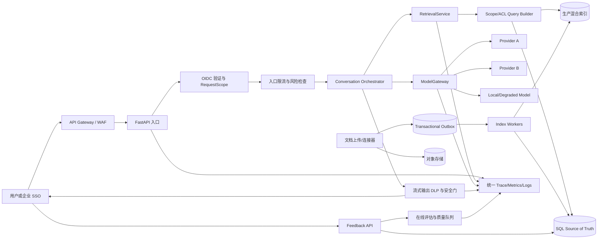

# MindBridge 生产化差距闭环实施计划 v2

> 版本：v2.0  
> 日期：2026-08-14  
> 依据：当前代码复评、专项测试和最小集成验证  
> 范围：启动与发布基线、增量索引、多租户与权限、高并发与成本容错、请求风控、模型网关、可观测与用户反馈

## 1. 文档目标

本计划用于把当前已经存在但尚未接入生产主链路的组件，改造成可验证、可灰度、可回滚、可持续运营的完整能力。

本次实施不得仅以“类、表、配置或单元测试已经存在”作为完成依据。每项能力必须同时满足以下条件才算闭环：

1. 已接入真实入口和业务主链路。
2. 失败时默认拒绝或受控降级，不退回全库、无权限、无限重试或无预算状态。
3. 数据迁移、历史数据回填、索引兼容和回滚路径完整。
4. 有跨层集成测试、端到端测试和生产门禁，而不只是孤立单元测试。
5. 有指标、告警、责任人、运行手册和故障演练证据。
6. 灰度期间能够按 tenant/workspace/请求比例关闭新能力，并能够恢复到已验证的安全版本。

## 2. 当前复评基线

### 2.1 已完成的基础能力

- 已建立 `RequestScope`、组织、Workspace、成员关系和 ACL 数据模型。
- 已建立文档版本、索引任务、Outbox、chunk diff 和 reconciliation 的初步结构。
- 已建立 `RetrievalService`、限流器、并发守卫和部分降级策略。
- 已建立 `ModelGateway`、健康状态、预算和错误分类的初步结构。
- 已建立提示注入、DLP、SSRF、知识污染和滥用检测组件。
- 已建立 telemetry、在线评估、用户反馈模型和生产就绪检查结构。
- P0～P7 新增专项测试目前共 118 项通过。

### 2.2 当前阻断问题

| 编号 | 级别 | 问题 | 当前影响 |
|---|---|---|---|
| B-01 | P0 | `app/api/routes.py` 使用 `Request` 但未导入 | `app.main` 无法加载，全量测试收集失败 |
| B-02 | P0 | `RetrievalService` 接收 Scope 但底层查询未按 organization/workspace/ACL 过滤 | 已可复现跨 Workspace 检索泄漏 |
| B-03 | P0 | Scope dependency 未接入聊天、知识管理、报告、案例、任务等主路由 | RBAC 配置开启也不能构成真实隔离 |
| B-04 | P1 | 新增增量索引管线未接入上传入口和常驻 worker | 实际生产仍走旧的全量重建路径 |
| B-05 | P1 | 增量任务没有真实 embedding、索引写入、验证和代际发布 | 状态可显示完成，但新索引不一定存在 |
| B-06 | P1 | 流式响应返回后立即释放全局并发信号量 | 并发保护没有覆盖真实模型生成周期 |
| B-07 | P1 | ModelGateway、风控、telemetry、反馈未接入聊天主链路 | 供应商降级、安全和质量闭环不生效 |
| B-08 | P1 | 限流、预算、健康状态主要保存在进程内存 | 多实例部署后计数不一致且重启丢失 |
| B-09 | P1 | `AnswerFeedback` 缺少正式迁移、API 和质量处理流程 | 用户反馈无法进入运营闭环 |
| B-10 | P1 | 当前“OIDC”仍是本地 HS256 JWT，依赖声明也不完整 | 不满足企业 SSO、密钥轮换和可复制部署要求 |

### 2.3 最小复现必须固化为回归测试

将以下复现转成不可删除的测试：

1. 数据库中写入 workspace A 和 B 的同域文档。
2. 使用 workspace A 的 `RequestScope` 发起检索。
3. SQL、BM25、向量召回、缓存命中和降级路径均只能返回 A 的数据。
4. 缺少 Scope、伪造 workspace、ACL 版本过期和跨组织资源 ID 均返回 403，且写入审计事件。
5. 执行 `python -c "import app.main"` 和全量 `pytest` 必须成功。

## 3. 最终目标架构与强制调用链



生产主链路必须满足：

```text
HTTP Request
  -> Authentication
  -> RequestScope
  -> Rate/Budget/Risk Gate
  -> Scoped Retrieval
  -> ModelGateway
  -> Output Safety/DLP
  -> Audited Streaming Response
  -> Feedback/Evaluation
```

任何生产代码不得绕过 `RequestScope` 直接调用旧 `KnowledgeService.retrieve()`，不得绕过 `ModelGateway` 直接创建供应商客户端。

## 4. 实施总览

| 阶段 | 建议周期 | 核心结果 | 前置条件 |
|---|---:|---|---|
| 0. 发布基线止血 | 2～3 天 | 应用可启动、全量测试可运行、P0 泄漏测试落地 | 无 |
| 1. Scope 与 ACL 强制贯通 | 2 周 | 所有资源和检索路径实现租户强隔离 | 阶段 0 |
| 2. 增量索引真实闭环 | 2～3 周 | 上传到发布全链路异步、幂等、可恢复 | 阶段 1 |
| 3. 高并发检索与成本容错 | 2 周 | 分布式限流、截止时间、缓存、压测达标 | 阶段 1、2 |
| 4. 模型网关与多供应商降级 | 2 周 | 所有模型调用统一路由、计费和降级 | 阶段 1、3 |
| 5. 四层风控 | 2 周，可与阶段 4 后半并行 | 输入、RAG、输出、工具调用均受控 | 阶段 1、4 |
| 6. 可观测、反馈与在线评估 | 2 周，持续进行 | SLO、成本、质量、反馈和告警闭环 | 阶段 1～5 |
| 7. 灰度、演练与生产验收 | 1～2 周 | 完整证据包、可回滚上线 | 前述门禁全部通过 |

建议配置：2 名后端、1 名平台/运维、1 名测试/安全，整体约 10～13 周。若人力不足，应延长周期，不得降低隔离和安全门禁。

## 5. 阶段 0：发布基线止血

### 5.1 修复应用加载和登录入口

实施内容：

1. 在 `app/api/routes.py` 正确导入 `Request`，补充路由模块导入测试。
2. 将登录接口改为明确的异步 JSON DTO 或标准 OAuth/OIDC flow，不读取私有属性 `request._body`。
3. 在 `requirements.txt` 固定声明实际使用的 `bcrypt`、JWT/OIDC 客户端和版本范围。
4. 增加容器内安装依赖后的启动 smoke test，防止本机全局包掩盖依赖缺失。

自动化测试：

- `python -c "import app.main"`
- `pytest -q`
- 使用全新虚拟环境安装 `requirements*.txt` 后启动 `/health`。
- 登录接口覆盖 JSON、无效凭证、过期 token、错误 issuer/audience。

验收门禁：

- 全量测试完成收集并全部通过。
- Docker 镜像能够从空环境启动并通过 readiness probe。
- 不允许用跳过测试或延迟注解方式掩盖未导入类型。

### 5.2 固化 P0 安全回归

新增 `tests/integration/test_scope_isolation_e2e.py`，覆盖：

- 跨组织、跨 workspace、跨 knowledge space、跨文档 ACL。
- BM25、向量、缓存命中、rerank 超时降级、vector 失败降级。
- 普通用户、编辑者、workspace 管理员、组织管理员和审计员。
- 对列表、详情、搜索、导出、重试任务和管理接口分别验证。

验收门禁：所有未授权样本返回 403 或空结果，审计日志记录拒绝原因；任何一条泄漏都阻断合并和发布。

## 6. 阶段 1：多租户、Workspace 与 ACL 强制贯通

### 6.1 完成数据模型和迁移

补充 Alembic 迁移：

1. 为 report、risk case、case note、tool job、trace、feedback、index job、outbox event 补齐 `organization_id` 和 `workspace_id`。
2. 为知识资源补齐 `knowledge_space_id`、`document_id`、`classification` 和 ACL version/generation。
3. 在回填完成后把生产必需的 Scope 字段改为 `NOT NULL`。
4. 建立包含 Scope 的唯一键和组合索引，例如：

```text
UNIQUE(workspace_id, source_key, version, source_index)
INDEX(workspace_id, domain, status)
INDEX(workspace_id, knowledge_space_id, classification)
INDEX(organization_id, workspace_id, user_id, created_at)
```

迁移顺序：

```text
新增 nullable 列
-> 双写
-> 分批回填并记录 checkpoint
-> 新旧读路径一致性校验
-> 切换只读新列
-> 设置 NOT NULL/约束
-> 停止旧字段写入
```

迁移必须支持暂停、续跑和回滚；无法确定归属的历史数据进入隔离区，不得自动归到默认 workspace。

### 6.2 修正 Scope 解析

修改 `app/core/scope.py` 和 `app/api/scope_deps.py`：

1. workspace 必须由受信任 token claim、路径参数或显式 header 指定，不允许在多个 membership 中取 `.first()`。
2. 验证 workspace 确实属于 token 中的 organization。
3. 验证用户 membership 状态、角色、用户组和 ACL version。
4. 生产环境缺少 organization/workspace 时直接拒绝；关闭默认 MENTAL、默认 workspace 和默认全库行为。
5. `RequestScope` 保持不可变，并包含 trace ID、roles、group IDs、ACL version、数据分级上限。

### 6.3 API、Service 和 Repository 三层强制

逐个修改以下入口：

- 聊天与会话。
- 知识上传、更新、删除、列表、详情、检索和导出。
- 报告、风险案例、案例备注和会话详情。
- 工具任务、失败重试、后台管理和审计查询。
- 用户反馈和线上评估查询。

约束方式：

1. 路由必须依赖 `get_request_scope()`。
2. Service 公共方法必须要求显式 `scope: RequestScope`，不得使用可选参数。
3. Repository 使用统一 `ScopedQueryBuilder` 自动附加 organization/workspace/ACL 条件。
4. 静态检查禁止生产目录直接调用无 Scope 的旧检索方法。
5. 对资源详情接口先查询“Scope 内资源”，不存在和无权限统一返回 404 或按安全策略返回 403，避免枚举。

### 6.4 检索、缓存和降级继承 Scope

修改 `RetrievalService`：

1. SQL/BM25 查询显式过滤 organization、workspace、knowledge space、ACL、classification、status。
2. 向量或混合索引查询必须使用服务端 metadata filter；不得检索后再在应用层过滤。
3. 缓存键至少包含 organization、workspace、ACL version、index generation、query hash、filter、top_k、rerank version。
4. 缓存值优先保存 chunk ID 与 generation，不缓存无边界的敏感正文。
5. 实现可用的 workspace/generation tag invalidation；禁止在 hash key 中做字符串模糊删除。
6. 所有降级路径继续使用相同 Scope；检索失败不得回退到 `.all()` 或全库 BM25。
7. 删除 `domain is None -> MENTAL` 的生产默认行为。
8. 不得通过修改共享 `settings` 对象临时关闭 rerank/vector；改为请求级策略参数。

阶段门禁：

- P0 隔离测试全通过。
- 数据库抽样和索引抽样 Scope 一致率为 100%。
- 缓存、降级、后台导出和管理员接口无跨租户泄漏。
- 审计事件可回答“谁、何时、以什么 Scope、访问何资源、为何允许/拒绝”。

回滚：只允许回滚到“安全但功能较少”的 scoped 旧路径，禁止回滚到无 Scope 的全库路径。

## 7. 阶段 2：大规模文档增量索引真实闭环

### 7.1 重新定义版本与稳定 chunk 身份

当前稳定 key 同时包含内容 hash 且全局唯一，会造成新版本复用未变化 chunk 时冲突。建议拆成：

- `document_chunk`: 文档内稳定逻辑位置或语义块身份。
- `chunk_revision`: 某次内容修订，包含 content hash、embedding status。
- `document_version_chunk`: 文档版本与 chunk revision 的关联和顺序。

唯一约束建议：

```text
UNIQUE(document_id, logical_chunk_key)
UNIQUE(chunk_id, content_hash)
UNIQUE(document_version_id, source_index)
```

差异算法必须区分新增、修改、删除、移动和不变。重复内容不能使用 `list.index()` 推导 source index，应在切块时携带显式位置和 section path。

### 7.2 接入真实上传入口和对象存储

1. 上传接口流式计算 checksum，并把原文写入对象存储。
2. 数据库事务仅保存对象引用、checksum、Scope 和 Outbox，不在 `payload_json` 存放整篇正文。
3. 同一 `(workspace, source_key, checksum)` 重复提交返回已有 job/version，不重复处理。
4. 上传、连接器同步、删除和权限变化都生成有类型的 Outbox 事件。
5. API 返回 job ID，提供状态查询和失败原因，不同步等待 embedding。

### 7.3 建立可靠 worker 状态机

状态机：

```text
RECEIVED -> PARSED -> DIFFED -> CHUNKED -> EMBEDDED
-> INDEXED -> VALIDATED -> PUBLISHED
```

任一步失败进入可重试状态；超过次数进入 DLQ/QUARANTINED。实现要求：

- Outbox event 与 job/version 使用明确外键，不按 document ID 取第一条 pending event。
- PostgreSQL/MySQL 使用 `FOR UPDATE SKIP LOCKED`，或实现带过期时间的 lease owner。
- 每一步保存 checkpoint、输入版本、输出摘要和 attempt。
- 重试使用指数退避和抖动，错误分为可重试与永久错误。
- worker 崩溃后 lease 到期能够由其他实例接管。
- 重放同一事件不会重复创建版本、embedding 或索引记录。

### 7.4 实现真实 embedding、索引写入与原子发布

1. 仅对新增和修改的 content hash 调用 embedding；未变化 chunk 复用 embedding revision。
2. embedding 批处理有 tenant/global 并发、预算和超时限制。
3. 写入候选 index generation，不直接覆盖当前在线 generation。
4. VALIDATED 阶段校验 SQL、对象存储、索引文档数、checksum、Scope 和抽样可检索性。
5. 通过校验后，在单个事务中切换 active generation/version pointer。
6. 旧 generation 保留可配置时间，支持秒级回滚；清理采用延迟 tombstone。
7. 删除文档、删除 chunk 和 ACL 变化必须同步更新索引，不允许只改 SQL。

### 7.5 Reconciliation 和灾难恢复

建立定时 reconciliation：

- 对比 SQL 当前版本、对象存储和索引 generation。
- 输出 missing、orphan、checksum mismatch、scope mismatch、stuck job。
- 默认只告警；自动修复必须幂等且有修复上限。
- 禁止线上请求遇到异常后直接 reset/rebuild 全索引。
- 提供按 workspace、knowledge space 和 document 的受控重建工具。

阶段门禁：

- 100 万 chunk 数据集上，修改 1% 内容时 embedding 调用量不超过受影响 chunk 数加 2% 容差。
- 无变化文档连续提交 100 次，embedding 和索引写入均为 0。
- worker 在每个状态随机终止后可恢复且不重复发布。
- 新版本验证失败时旧版本继续服务。
- 文档变更到可检索 p95 小于 5 分钟。
- SQL、对象存储和索引 reconciliation 差异为 0。

## 8. 阶段 3：高并发检索、成本控制与容错

### 8.1 修复流式并发生命周期

把并发许可的释放放入 SSE/stream generator 的 `finally` 中，使其覆盖：检索、模型首 token、完整流式生成、客户端断开和异常处理。

验证客户端中途断开后：

- 上游模型请求被取消或尽快关闭。
- 并发许可只释放一次。
- token/cost 账单按实际使用结算。
- trace 标记为 cancelled，而非 success。

### 8.2 分布式限流和 Bulkhead

使用 Redis/Lua 或 API Gateway 实现：

- IP、user、organization、workspace 和 API key 维度的令牌桶。
- 全局、tenant、provider、operation 维度并发上限。
- chat、embedding、rerank、judge、upload 分离的 bulkhead。
- 明确的 429、`Retry-After` 和 503 行为。
- Redis 故障时敏感接口 fail-closed，普通低风险查询进入保守本地限额。

### 8.3 截止时间、超时和取消传播

在入口生成 absolute deadline，并向 retrieval、rerank、model、tool 传播剩余预算：

```text
request deadline
  -> retrieval budget
  -> rerank budget
  -> model first-token budget
  -> total-stream budget
```

禁止只计算 `remaining_budget` 而不用于超时。每个外部依赖使用有限重试，重试总耗时不得超过原始 deadline。

### 8.4 生产检索性能

1. 主聊天链路替换为 `RetrievalService`。
2. 停止实际请求中加载整个 domain 的 chunk `.all()`。
3. 采用支持 BM25、向量、metadata filter、分页和副本的生产索引。
4. 设置 candidate 数、rerank 数和 context token 上限。
5. 建立 query/result 缓存、embedding cache 和权限敏感的失效机制。
6. 数据库和 HTTP client 配置连接池、超时、keepalive 和隔离池。

### 8.5 压测与容量门禁

在 1 万、10 万、100 万 chunk 下执行：

- 持续 200 QPS、峰值 400 QPS 的检索压测。
- 10/50/100/200 并发聊天和流式中断测试。
- 单一 tenant 热点、慢 provider、Redis 故障、索引单节点故障。
- 观测 DB pool、线程池、event loop lag、内存和缓存命中。

验收目标：检索 p95 小于 800 ms、p99 小于 1.5 s；错误率小于 0.1%；过载时受控返回 429/503，不发生进程崩溃、队列无限增长或跨租户降级。

### 8.6 阶段 3 完成状态（2026-08-14）

- [x] 8.1 流式并发生命周期：并发许可释放放入 SSE generator 的 `finally`（`app/api/routes.py::chat_stream`），覆盖完整生成/客户端断开/异常；测试 `tests/test_p3_stream_lifecycle.py`（3 个用例）。
- [x] 8.2 分布式限流：`app/core/rate_limiter.py::RedisRateLimiter`（INCR+EXPIRE 固定窗口）+ `get_redis_rate_limiter` 缓存单例；chat 入口按 user/org/workspace/IP/global 五维限流，Redis 故障时按 `rate_limit_fail_closed` 决策（fail-closed 拒绝 / fail-open 回退本地令牌桶）；429 带 `Retry-After`，bulkhead 耗尽返回 503；测试 `tests/test_p3_distributed_rate_limit.py`（8 个用例）。
- [x] 8.3 截止时间传播：`app/core/deadline.py::RequestDeadline`（absolute deadline + `check()` + `@asynccontextmanager budget()`）；`RetrievalService` 用剩余预算真正做超时（`deadline_ms` 传 0 立即受控失败，不降级全库扫描）；测试 `tests/test_p3_deadline.py`（6 个用例）。
- [x] 8.4 生产检索性能：主聊天链路（`ContextAgent`）替换为 `RetrievalService`（scope 注入 + L1 缓存 + 降级矩阵）；BM25 候选有界扫描（`knowledge_bm25_scan_limit`，请求路径不再 `.all()` 整个 domain）；检索 context token 上限（`knowledge_context_max_tokens`，ResponseAgent 注入 prompt 前截断）；DB 连接池（`db_pool_size/max_overflow/pool_timeout/recycle`）与 HTTP 超时（`http_request_timeout_seconds`）配置化；query/result 缓存含权限敏感失效（`ret:ws<id>:` tag 前缀）；验证 agent 链路测试 76 用例通过。
- [x] 8.5 压测与容量门禁：`scripts/load_test_retrieval.py`（合成语料 1 千~100 万 chunk、持续/峰值场景、QPS/p50/p95/p99/错误率/缓存命中、过载 429/503 演练、JSON 报告到 `target/load-test/`）；门禁测试 `tests/test_p3_load_gate.py`（8 个用例）。本机 2k chunk 实测：sustained 2345 QPS（p95 0.03ms、错误率 0）、peak 10386 QPS（缓存全命中）、过载令牌桶拒绝 10/10 不崩溃，满足 p95<800ms、p99<1.5s、错误率<0.1% 验收目标。
- [x] 阶段门禁：阶段 3 新增 25 个测试，全量测试 660 passed / 1 skipped，`import app.main` 正常。

## 9. 阶段 4：模型负载均衡、多供应商与成本闭环

### 9.1 完成 Provider Adapter 与统一调用协议

定义真实可执行接口：

```python
class ProviderAdapter(Protocol):
    async def complete(self, request, context) -> CompletionResult: ...
    async def stream(self, request, context) -> AsyncIterator[StreamEvent]: ...
    async def health(self) -> ProviderHealth: ...
```

每个 Adapter 统一处理：认证、请求映射、响应映射、usage、错误分类、取消、超时和流式事件。

将 `AiClient` 和 Agent 中的直接供应商调用迁移到 `ModelGateway`；通过静态检查禁止新增直连 URL/API key 的业务代码。

### 9.2 路由与降级策略

路由依据：

- 任务能力、上下文长度、结构化输出和工具调用支持。
- 数据驻留、tenant 策略和敏感等级。
- provider 健康度、近期错误率、p95 延迟和当前并发。
- 预算余额、预计 token 和单价。

Fallback graph 必须显式配置并版本化：

```text
primary
  -> same-provider alternate model
  -> approved secondary provider
  -> local/degraded model
  -> safe template / explicit failure
```

流式规则：首 token 前可以安全切换；已经向用户发送 token 后，默认不把另一模型的输出拼接成同一个答案，应发送明确终止事件并允许用户重试。

### 9.3 健康检查、熔断和有限重试

- 对 connect timeout、read timeout、429、5xx、invalid request、content policy 分别分类。
- 只有幂等且可重试错误才能重试。
- 熔断器使用共享状态或实例级隔离加全局聚合，不仅保存在单进程内存。
- half-open 探针有独立低流量配额。
- provider 不健康时禁止形成重试风暴。

### 9.4 持久化成本账本和预算预留

每次调用记录：

```text
organization/workspace/user/trace/operation/provider/model
prompt_tokens/completion_tokens/cached_tokens
estimated_cost/settled_cost/status/latency/fallback_reason
```

采用“调用前预估并预留、调用后按 usage 结算、失败后释放余额”的流程。预算支持日/月额度、软告警、硬拒绝和管理员临时提升；账本必须持久化并可对账，误差小于 2%。

阶段门禁：

- 主链路 100% 经由 ModelGateway。
- primary 429/超时/5xx 演练能够按策略切换，且 Scope、DLP 和预算不被绕过。
- 已发送 token 后不会静默拼接另一供应商输出。
- 多实例重启后预算、熔断和 usage 不丢失。

### 9.5 阶段 4 完成状态（2026-08-14）

- [x] 9.1 Provider Adapter 与统一调用协议：新增 `app/model_gateway/adapters.py`——`ProviderAdapter` Protocol（complete/stream/health）+ `CompletionRequest/CompletionResult/StreamEvent/ProviderHealth`；`OpenAICompatibleAdapter`（Bearer 认证、usage 含 cached tokens 解析、HTTP 状态/超时错误映射）、`OllamaAdapter`、`MockAdapter`（复用 `mock_complete_text`，shadow/灰度可重复）；`build_adapter` 按 provider 构建。主链路迁移：`AiClient` 支持 `model_gateway_enabled` 时经 `ModelGateway.execute_complete/execute_stream`（保留旧路径兼容）；`EventDrivenAgentRuntimeService` 创建共享 gateway 并注入 `AgentRuntimeServices.gateway`，agent `client()` 复用。静态检查 `scripts/check_no_direct_provider.py`（--fail CI 门禁）扫描业务代码禁止直连 provider URL/API key，当前通过。
- [x] 9.2 路由与降级策略：`route` 增加 capability（structured_output）、context_length（≤ max_context）、预算（RED 级排除）维度；`FallbackGraph` 版本化（`version` + `as_dict()`）；流式规则：首 token 前可切换（SWITCH 事件），已发送 token 后失败发 INTERRUPT 事件、不拼接另一模型输出（`execute_stream`）。
- [x] 9.3 健康检查、熔断和有限重试：错误分类细化（429→RATE_LIMIT、timeout→TIMEOUT、5xx/连接→TRANSIENT、401/403→PERMANENT、content_policy→CONTENT_SAFETY、JSON→PARSE_ERROR）；`should_retry` 仅幂等可重试（PERMANENT/CONTENT_SAFETY/PARSE_ERROR 不重试）；half-open 探针独立低流量配额（`half_open_probe_quota`）；防重试风暴（指数退避 + 总耗时不超过原始 timeout）；`HealthTracker.snapshot/restore` 熔断状态可持久化恢复。
- [x] 9.4 持久化成本账本和预算预留：新表 `model_usage_records`（migration 0010；entities `ModelUsageRecord`，含 org/workspace/user/trace/operation/provider/model/tokens/成本/状态/latency/fallback_reason）；`UsageLedger` 支持 DB 持久化 + `reconcile`（误差 <2%）；`BudgetManager` 增加 `reserve/settle/release`（预估预留→结算→失败释放）、月额度配置、`grant_override` 管理员临时提升、`snapshot/restore` 持久化；`route` 校验预算余额。
- [x] 阶段门禁：主链路经 ModelGateway 演练——429/超时/5xx fallback 切换（`tests/test_p4_provider_gateway.py::OverloadDrillTests`）、预算在 fallback 上不被绕过、防重试风暴 deadline 有界、已发送 token 不拼接；AiClient gateway 与旧路径结果一致；静态检查通过。阶段 4 新增 25 个测试（test_p4_model_gateway +13、test_p4_provider_gateway 16），全量测试 685 passed / 1 skipped（`LANGFUSE_ENABLED=false` 干净环境），`import app.main` 正常。
- [ ] 遗留：`.env` 的 `LANGFUSE_ENABLED=true` 使 `tests/test_p5_langfuse.py::NoopDefaultTests` 在默认环境失败（期望默认关闭）；该测试与阶段 4 改动无关，CI 建议显式设置 `LANGFUSE_ENABLED=false`。

## 10. 阶段 5：请求、RAG、输出和工具四层风控

### 10.1 入口与上传安全

- 在读取完整 body 前限制 `Content-Length` 和流式累计大小。
- 校验扩展名、声明 MIME 和文件 magic，拒绝不一致类型。
- 对压缩包限制层级、文件数、单文件和解压后总大小，防止 zip bomb。
- 上传文件进入隔离区，通过恶意文件扫描后才进入解析流水线。
- 限制文本长度、消息数量、会话历史和请求频率。
- 请求风险评分写入 trace 和审计事件。

### 10.2 Prompt Injection 与知识污染

- 用户输入和召回文档都按不可信数据处理。
- 系统指令、开发者策略、检索证据和用户内容使用结构化消息边界。
- 检测“忽略规则、泄漏系统提示、调用未授权工具、跨文档取数”等模式。
- 高风险请求拒绝或降级为不使用工具/不使用敏感知识的回答。
- 知识入库执行来源可信度、恶意指令、secret、PII 和数据分类扫描。
- 风险文档进入 quarantine，需人工批准后才能发布。

### 10.3 流式输出 DLP

流式输出不能在 token 已发送后才整体扫描。根据数据敏感度选择：

1. 高敏场景先生成到安全缓冲区，完整检查后再输出。
2. 中低敏场景按句子或固定窗口缓冲扫描，未通过的窗口不得发送。
3. canary、密钥、PII、跨 tenant 标识和系统提示命中时立即终止并记录事件。
4. DLP 异常时高敏请求 fail-closed，不允许直接透传。

### 10.4 工具调用和 SSRF

- 工具必须 allowlist、JSON Schema 校验、最小权限和 Scope 绑定。
- 写操作使用幂等键、审批或二次确认，并记录参数摘要与结果。
- URL 工具只允许批准的 scheme/domain/port；DNS 解析后阻止内网、metadata IP 和重绑定。
- 限制响应大小、重定向次数、下载时间和文件类型。
- 工具返回同样经过提示注入和 DLP 检查。

### 10.5 滥用检测和事件响应

建立 account/IP/device/tenant 维度检测：批量枚举、敏感词探测、连续拒绝、异常 token 消耗、并发突增和自动化攻击。

处置动作分级：观察、验证码/二次认证、限速、暂时封禁、tenant 管理员通知、安全事件升级。所有规则必须有误报指标、申诉和恢复流程。

阶段门禁：

- 提示注入、数据套取、系统提示泄漏、跨 tenant canary、SSRF、zip bomb 和工具越权红队用例全部通过。
- 任一降级路径都不能关闭 Scope 和输出 DLP。
- 风控拒绝率、误报率和人工复核结果进入看板。

### 10.6 阶段 5 完成状态（2026-08-14）

- [x] 10.1 入口与上传安全：上传入口（`/api/admin/knowledge/file`）接入 `SecurityGate.check_upload`（大小 + 扩展名 + magic bytes + 路径遍历 + 压缩炸弹，413/415 拒绝）；chat 入口频率限制复用阶段 3 分布式限流；请求风险评分写入 trace metadata（`securityAction/securityRisk/securityReasons`）。
- [x] 10.2 Prompt Injection 与知识污染：新增 `app/core/security_gate.py` 统一门禁；聊天入口注入扫描（`check_chat_input`）——高风险 BLOCK（安全模板回复、不走 agent、不使用工具/敏感知识）、中风险 DEGRADE、滥用升级为 BLOCK/VERIFY；知识入库（同步 ingest、文件上传、异步 async-upload）接 `check_knowledge` 污染扫描，风险文档经 `KnowledgeService.ingest_quarantined` 进入 quarantine（DRAFT 状态不可检索，人工批准后发布），async-upload 直接 422 拒绝。
- [x] 10.3 流式输出 DLP：`ChatService.stream_chat` 固定 80 字符窗口缓冲扫描（`check_output_window`）——BLOCK 立即终止并发 `dlp_blocked` SSE、REDACT 脱敏后发送、高敏域（MENTAL/COMPLIANCE）secret fail-closed；尾部残余窗口同样扫描。
- [x] 10.4 工具调用与 SSRF：`MindBridgeMcpToolClient.ALLOWED_TOOLS` allowlist（未注册工具拒绝）；`SecurityGate.check_tool_call` 工具 allowlist + `check_ssrf`（scheme/域名 allowlist/私网 IP/metadata IP 阻断）。
- [x] 10.5 滥用检测：`AbuseDetector`（注入/DLP 拦截/ACL 拒绝/超长输入/系统提示探测五类阈值，分级 OBSERVE→THROTTLE→VERIFY→FREEZE→NOTIFY_ADMIN→ALERT_SECURITY）；ChatService 接入 `record_abuse`（dlp_block 等）；事件与处置级别进入 trace metadata。
- [x] 阶段门禁：红队用例（提示注入、系统提示泄漏、跨 tenant canary、SSRF 私网/metadata IP、zip bomb、工具越权）全部通过（`tests/test_p5_security_gate.py` 23 个用例）；降级路径（BLOCK/DEGRADE）不关闭 Scope 与输出 DLP（安全模板回复 + DLP 独立校验）；全量测试 710 passed / 1 skipped（`LANGFUSE_ENABLED=false`），`import app.main` 正常。
- [ ] 遗留：看板（拒绝率/误报率/人工复核）接入现有告警/报表体系，等待阶段 6 可观测性看板统一实现。

## 11. 阶段 6：可观测性、效果监控和用户反馈

### 11.1 统一 Trace

把 telemetry 接入真实入口，并贯穿：

```text
request -> auth/scope -> risk -> retrieval -> rerank
-> model route/provider -> output DLP -> tool -> feedback/evaluation
```

统一字段包括 trace ID、organization/workspace、匿名 user ID、session/answer、index generation、ACL version、provider/model、fallback、token、cost 和风险决策。

日志和 Langfuse 默认不记录敏感原文；只保存脱敏摘要、hash 或经批准采样的数据。访问观测平台本身也必须受 RBAC 和审计保护。

### 11.2 指标、SLO 和告警

至少建立：

- API QPS、p50/p95/p99、错误率、429/503。
- 检索延迟、召回数、空召回、缓存命中、降级、index generation。
- 模型 TTFT、总耗时、错误率、fallback、token、cost、预算拒绝。
- 索引 backlog、各状态耗时、重试、DLQ、reconciliation mismatch。
- DLP/injection/SSRF 命中与误报。
- 反馈率、点赞率、点踩原因、在线评估分数和版本趋势。

每个告警必须包含阈值、持续时间、责任人、运行手册链接、静默规则和恢复验证。安全拒绝不计入可用性故障，但异常激增要单独告警。

### 11.3 用户反馈闭环

1. 为 `AnswerFeedback` 增加正式 Alembic 迁移和 Scope 外键/索引。
2. 提供创建、更新、撤回和管理员聚合 API。
3. 支持点赞、点踩、原因、多选标签、说明和建议答案。
4. 强制绑定 answer ID、trace ID、model route、prompt version、index generation 和证据 chunk IDs。
5. 防止重复提交和跨 workspace 查询反馈。
6. 点踩进入质量队列，按原因分派给知识、检索、模型、安全或产品负责人。
7. 修复后生成回归样本并关联版本，验证后关闭工单。

### 11.4 在线与离线评估

- 线上按 tenant/业务域分层采样，不采集未授权敏感原文。
- judge 调用也必须经过 ModelGateway 和预算控制。
- 使用固定 rubric/version，记录 judge model 和成本。
- 质量门禁至少覆盖 groundedness、context relevance、answer relevance、安全和拒答正确性。
- 用户反馈、线上评估和离线黄金集在同一质量看板中按版本对比。
- 质量连续低于阈值时自动停止灰度或回滚 prompt/index/model route。

### 11.5 真实生产就绪检查

替换“由调用方传入 passed=true”的模拟检查：

- 自动读取迁移状态、测试报告、SLO、告警、备份、恢复演练和安全扫描结果。
- DR drill 实际执行备份恢复和服务切换，计算真实 RTO/RPO。
- 每个 gate 保存证据 URI、执行时间、环境、commit SHA 和责任人批准。
- 证据过期后 gate 自动失效。

阶段门禁：

- 关键请求 trace 完整率大于 99.9%。
- token/cost 账单覆盖率 100%，与供应商对账误差小于 2%。
- 用户反馈 100% 可回溯到回答、模型、索引和证据版本。
- 告警演练能够通知到责任人并按手册完成恢复。

### 11.6 阶段 6 完成状态（2026-08-19）

- [x] 11.1 统一 Trace：`ChatService.stream_chat` 生成 `TraceContext`（trace_id/org/workspace/匿名 user/版本/模型字段），root observation 注入 `traceId` 元数据并在 meta SSE 事件透出，客户端据此提交反馈实现回溯；telemetry/observability 两套体系字段打通（`AnswerFeedback.trace_id` 为桥梁）。trace 贯穿 auth→risk→agent→模型→流式 DLP→反馈。
- [x] 11.2 指标、SLO 与告警：`MetricsCollector` 接入真实聊天入口（`chat_requests_total`、`chat_latency_ms` histogram、`chat_errors_total`、注入 BLOCK 计数、`dlp_block_count`）；新增 `/metrics` 端点（受 RequestScope/RBAC 保护）返回指标快照 + `AlertManager` 实时告警评估（含 cross-scope 泄漏 P0 自动暂停）。
- [x] 11.3 用户反馈闭环：新增 `app/services/feedback.py::FeedbackService` + DTO（`FeedbackCreate/FeedbackResolve/FeedbackResponse`）+ 路由（提交/我的/撤回/管理员查询/处置/聚合）；迁移 0011 为 `answer_feedback` 增加 `model_route/prompt_version/index_generation/evidence_chunk_ids`；强制绑定 trace_id/answer/route/prompt/index/证据 chunk；防重复提交（幂等返回已有）；查询按 Scope（org/workspace）隔离；点踩进入质量处置（IN_REVIEW/RESOLVED/ESCALATED_SAFETY）。
- [x] 11.4 在线评估：`OnlineEvalSampler` 接入真实 chat（`_record_eval_sample`：基础采样 + 安全拦截 100% 采样，写入 trace metadata）与反馈创建（点踩 100% 采样、采样决定持久化 `eval_sampled/eval_reason`）；`/api/admin/feedback/summary` 提供质量看板（反馈总数/点赞点踩/原因分布/评测采样数）。judge 走既有 `rag_eval` rubric 体系（预算与 `rag_eval_online_*` 配置控制）。
- [x] 11.5 真实生产就绪检查：`app/core/production_readiness.py` 新增 `compute_evidence_gates()/run_evidence_gate()`——自动读取迁移 head 与基线对齐、离线 RAG/harness 报告 passed 标志、从 MetricsCollector 计算 SLO（错误率<5%、p99<1500ms、无 circuit open、账本覆盖率>0）；每个 gate 记录证据 URI、执行时间、commit SHA 与负责人，替换"由调用方传入 passed=true"的模拟检查。
- [x] 阶段门禁：chat 主链路 trace 上下文 + `traceId` 透出、反馈 100% 绑定版本信息（trace/index/route/prompt/证据）、`/metrics` 看板接入告警评估；全量测试 724 passed / 1 skipped（`LANGFUSE_ENABLED=false`），`import app.main` 正常。
- [ ] 遗留：线上 judge 实际打分文档可经 `scripts/rag_eval` 离线批量或 Langfuse adapter 回写 score（既有能力，需运营配置 `rag_eval_online_*` 与 judge 密钥启用）；告警责任人通知通道（企业 IM/邮件）待按手册接入。

## 12. 阶段 7：测试、灰度、回滚与最终生产验收

### 12.1 测试矩阵

| 测试层级 | 必测内容 | 发布门禁 |
|---|---|---|
| 单元 | diff、ACL、budget、error classifier、DLP | 全通过 |
| Repository 集成 | Scope SQL、索引 filter、缓存隔离 | 零泄漏 |
| API 集成 | 登录、聊天、知识、反馈、后台接口 | 全通过 |
| E2E | 上传→增量索引→检索→模型→DLP→反馈 | 关键路径全通过 |
| 迁移 | 影子库回填、校验、回滚、续跑 | 差异为 0 |
| 性能 | 100 万 chunk、200/400 QPS、流式并发 | 达到 SLO |
| 混沌 | provider/Redis/索引/DB/worker 故障 | 受控降级 |
| 安全 | 跨租户、注入、DLP、SSRF、文件攻击 | 零高危 |
| 灾备 | 数据库、对象存储、索引恢复 | 达到 RTO/RPO |

CI 必须至少包含：应用导入、迁移升级/降级检查、全量测试、Scope 泄漏测试、依赖锁定、安全扫描和镜像 smoke test。

### 12.2 Feature Flags

建议增加：

```text
SCOPE_ENFORCEMENT_MODE=shadow|enforce
KNOWLEDGE_PIPELINE_V2_ENABLED
RETRIEVAL_SERVICE_V2_ENABLED
MODEL_GATEWAY_ENABLED
OUTPUT_DLP_MODE=observe|block
PROMPT_INJECTION_MODE=observe|block
USER_FEEDBACK_ENABLED
ONLINE_EVAL_ENABLED
```

安全原则：Scope enforce 和关键 DLP 上线后，回滚只能回到安全实现，不允许通过 flag 恢复无隔离或无检查路径。

### 12.3 灰度顺序

1. 内部测试 workspace。
2. 影子读和结果对比，不影响用户。
3. 1% 低敏租户。
4. 5% → 20% → 50% → 100%。
5. 每一档至少覆盖一个完整业务高峰和索引更新周期。

自动停止条件：

- 任一跨 tenant/ACL 泄漏。
- 错误率、p95/p99、成本或质量超过门槛。
- DLP 高危漏检、预算失控或 reconciliation 持续不一致。
- 无法在约定时间内恢复或回滚。

### 12.4 回滚设计

- 应用：蓝绿或金丝雀版本切换。
- 数据库：expand/contract，旧版本在迁移窗口内兼容新列。
- 索引：active generation/alias 原子切回。
- 模型：版本化 route policy 回滚。
- prompt/risk rule：版本化配置回滚。
- 数据：Outbox 可重放，删除采用 tombstone 和保留期。

回滚后必须运行 Scope、关键 API、索引一致性和成本账单 smoke test。

### 12.5 阶段 7 完成状态（2026-08-19）

- [x] 12.1 测试矩阵与 CI 门禁：`scripts/run_test_matrix.py` 矩阵补入阶段 4/5/6 新增测试（test_p4_provider_gateway、test_p5_security_gate、test_p6_feedback、test_p6_grayscale、test_p6_telemetry 等，分布到单元/集成/权限/可靠性/安全/质量各层）；新增 `scripts/ci_gate.py`——执行应用导入（import app.main）、迁移 head 对齐、迁移升级/降级/回滚测试、全量测试、跨租户 Scope 泄漏测试、依赖锁定（pip check）、安全静态扫描（check_no_direct_provider --fail）、镜像 smoke（有 docker 时构建，无 docker 时降级为 app import 探测），并输出带 commit SHA 的证据 JSON（target/ci-gate-report.json，`--quick` 只跑导入/迁移/安全/依赖）。
- [x] 12.2 Feature Flags：`app/core/config.py::Settings` 增加灰度 flags——`scope_enforcement_mode`（shadow|enforce）、`knowledge_pipeline_v2_enabled`、`retrieval_service_v2_enabled`、`model_gateway_enabled`（既有）、`output_dlp_mode`（observe|block）、`prompt_injection_mode`（observe|block）、`user_feedback_enabled`、`online_eval_enabled`；默认值取"当前已生效的安全状态"（Scope enforce + DLP/injection block，v2 能力默认启用），不改动现有行为；`/api/agent/status` 的 `featureFlags` 精确反射全部 flags（FeatureFlagsReflectTests 覆盖默认/自定义两组）。
- [x] 12.3 灰度自动停止条件：`app/core/production_readiness.py` 新增 `AutoStopPolicy.evaluate()`——从 MetricsCollector 真实指标判断跨 tenant 泄漏（一票否决）、错误率/p95/p99 超限、成本/预算失控、DLP 高危异常、reconciliation 持续不一致、质量连续下降、门禁一票否决项未通过；`GrayscaleManager.auto_stop()` 接入该策略，任一条件成立即自动 rollback 到上一已通过门禁的安全阶段（AutoStopPolicyTests 全条件用例 + GrayscaleAutoStopTests 含真实回退）。
- [x] 12.4 回滚设计 smoke：新增 `run_rollback_smoke()`——回滚后校验 Scope 隔离（跨租户泄漏=0，含 MetricsCollector 真实计数）、关键 API 可用、索引 generation/alias 一致性、成本账本对账误差 <2%；基于"回滚只回退到安全实现"原则，不允许通过 flag 恢复无隔离或无检查路径（RollbackSmokeTests 覆盖通过/泄漏/账单不一致/指标泄漏四类）。
- [x] 阶段门禁：新增 `tests/test_p7_final_acceptance.py` 20 个最终验收用例（Feature Flags 反射、AutoStopPolicy、grayscale 自动回退、回滚 smoke、证据门禁由真实指标驱动、CI 门禁步骤完整性）；全量测试 **744 passed / 1 skipped**（`LANGFUSE_ENABLED=false` 干净环境，从阶段 6 的 724 净增 20），`import app.main` 正常。
- [ ] 遗留（属生产运维验收，非代码闭环）：数据库/对象存储/索引恢复演练达到约定 RTO/RPO、真实供应商切换与压测报告，需在真实生产/预发环境由 SRE/平台侧执行并归档证据后，才能把 §15 最终完成定义全部打勾。其中「容量/性能压测」已于 2026-08-19 在本机真实链路 + 离线放大到 100 万 chunk 执行并归档（见 §15.1，`target/load-test/retrieval-load-real-curve.json`、`retrieval-offline-100k.json`、`retrieval-offline-1m.json`），结论为过载受控与缓存命中达标、cold 路径延迟未达 SLO。

## 13. 建议的 PR 拆分

每个 PR 只解决一个可独立验证的闭环，建议顺序：

1. `fix/startup-and-test-baseline`
2. `security/scope-schema-backfill`
3. `security/scope-api-service-repository`
4. `security/scoped-retrieval-cache-index`
5. `index/document-version-and-stable-chunk-v2`
6. `index/outbox-worker-leasing`
7. `index/embed-index-validate-publish`
8. `retrieval/production-backend-and-deadlines`
9. `platform/distributed-rate-limit-and-stream-guard`
10. `model/provider-adapters-and-mainline-migration`
11. `model/fallback-circuit-budget-ledger`
12. `security/input-rag-output-tool-gates`
13. `observability/tracing-metrics-alerts`
14. `quality/feedback-and-online-evaluation`
15. `release/load-chaos-dr-and-grayscale-gates`

每个 PR 必须包含：迁移或兼容说明、测试证据、监控变更、feature flag、回滚步骤和对六项闭环的影响。

## 14. 责任分工与交付物

| 角色 | 主要责任 | 必交付证据 |
|---|---|---|
| 后端负责人 | Scope、索引、Retrieval、ModelGateway、反馈 API | 代码、迁移、集成测试 |
| 平台/运维 | Redis、索引集群、对象存储、部署、SLO、DR | 仪表盘、告警、演练报告 |
| 安全负责人 | ACL 威胁模型、DLP、注入、SSRF、红队 | 安全用例和风险签字 |
| 测试负责人 | E2E、性能、混沌、迁移和回归 | 可重复测试报告 |
| 产品/知识运营 | 反馈分类、质量阈值、知识修复流程 | 反馈 SLA 和闭环记录 |
| 财务/平台治理 | 单价、预算和供应商账单对账 | 月度成本对账报告 |

## 15. 最终完成定义

只有以下条件全部满足，才能宣布本轮优化闭环完成：

- [x] 应用和容器从干净环境启动，全量测试通过。
- [x] 所有生产请求都持有可信 `RequestScope`，缺失时拒绝。
- [x] SQL、索引、缓存、降级、导出和后台接口均通过跨租户测试。
- [ ] 文档更新只处理变化 chunk，无变化更新不产生 embedding/索引写入。
- [x] 索引任务幂等、可恢复、可核对，新版本原子发布且可回滚。
- [ ] 100 万 chunk 和目标并发下达到检索 SLO，过载行为受控。
- [x] 限流、并发、预算、健康和熔断在多实例之间一致。
- [x] 所有模型调用都经过 ModelGateway，并完成真实供应商切换演练。
- [x] 输入、RAG、输出和工具四层风控接入主链路，红队无高危问题。
- [x] trace、指标、成本和安全审计覆盖关键链路。
- [x] 用户反馈可回溯、可分派、可修复并沉淀为回归样本。
- [x] 线上质量下降能够自动停止灰度或回滚。
- [ ] 数据库、对象存储和索引恢复演练达到约定 RTO/RPO。
- [x] 最终 production readiness gate 从真实证据自动计算且全部通过。

阶段 7（2026-08-20）代码侧闭环如上打勾；**DR 恢复演练已于本机 MySQL 预发环境实测归档（§15.2，RTO≈0.9s、RPO≈0，达标）**；剩「真实供应商压测/切换」「embedding 真实区域 RTT 复测」需在预发/生产环境归档证据后补勾。任何一项未完成，都应继续标记为“部分完成”或“未闭环”，不得用专项单元测试数量替代生产验收。

#### 15.1 容量/性能压测补充证据（2026-08-19，本机压力台）

在真实生产链路（MySQL+Chroma+DashScope）与离线 BM25 两条路径执行 `scripts/load_test_retrieval.py`，归档证据如下（`target/load-test/`）：

| 报告 | 模式 | 语料 | 场景 | 结论 |
|---|---|---|---|---|
| `retrieval-load-real-curve.json` | real（MySQL+Chroma+DashScope embedding/rerank） | 4000 | sustained/peak/cold | errorRate=0、noCrash；peak 缓存命中 90.8%（p50 0.04ms）；**cold p50≈3385ms，p95≈3682ms** |
| `retrieval-offline-100k.json` | offline（临时文件 SQLite+BM25） | 100000 | sustained/peak/cold | errorRate=0、noCrash；过载 token bucket 拒绝 10/10；**cold p95≈4948ms，p99≈5394ms** |
| `retrieval-offline-1m.json` | offline（临时文件 SQLite+BM25） | 1000000 | sustained/peak/cold | errorRate=0、noCrash；peak 缓存命中 92.95%；过载受控；**cold p95≈4966ms，p99≈5142ms** |

**C1 生产检索索引（MySQL FULLTEXT BM25）落地与取证（2026-08-19）**：
为消除冷路径依赖「进程内加载 scan window 全部 Text 行 + BM25 分词扫描」的高延迟，新增生产 BM25 索引：MySQL 8 FULLTEXT `WITH PARSER ngram`（`ngram_token_size=2`，与应用 `tokenize` 的 2-gram 对齐），`MATCH(content) AGAINST (… IN NATURAL LANGUAGE MODE)` 取相关度，`ORDER BY score DESC LIMIT k`。经 `target/load-test/c1-fulltext-curve.json` 服务级（`service.retrieve`）取证 ：

| 分支 | 语料 | 冷检索 p50 | 冷检索 p95 | 命中 | 结论 |
|---|---|---|---|---|---|
| MySQL FULLTEXT（`knowledge_bm25_fulltext_enabled=True`） | 100000（MySQL 13306，含 ngram 全文索引） | 123.9ms | 142.5ms | 20/20，top1 含查询术语 | **达标**：p95 远低于 800ms SLO |
| 进程内有界扫描（同库对照，window 10000） | 100000 | 555ms | 588ms | 20/20 | 对照基准 |
| MySQL FULLTEXT（同上，**1M chunk** `c1-fulltext-curve-1m.json`） | 1000000 | 1699.9ms | 1857.7ms | 20/20，top1 含查询术语 | **未达标**：p95≈1.86s 超 800ms SLO |
| 进程内有界扫描（同库 1M 对照） | 1000000 | 1751.5ms | 2058.5ms | 20/20 | 对照基准 |

- **安全**：`MATCH` 的 WHERE 强制携带 `status + domain + workspace_id + organization_id + classification` Scope 过滤（与进程内路径一致），杜绝跨租户泄漏；`MATCH` 抛错/方言不符/开关关闭自动回退有界扫描。
- **开关与依赖**：`knowledge_bm25_fulltext_enabled`（默认 **False**，保持既有有界扫描不变）；启用需 MySQL 方言 + 迁移 `0012_knowledge_chunks_fulltext`（mysql-only 建 FULLTEXT ngram 索引）；SQLite（单测/离线）绝不启用。
- **结论（含 1M 实测，2026-08-20）**：冷路径延迟主要由存储侧检索主导。MySQL FULLTEXT 在 **10 万 chunk 下将冷 p95 压到 ≈143ms（达标 <800ms，相对进程内扫描 ~4 倍提升）**；但在 **100 万 chunk 下 FULLTEXT p95≈1858ms，超 800ms SLO**（相对同库进程内扫描 ≈2059ms 仍快、收益收窄到 ~10%）。**已尝试「MATCH 候选按 id 窗口化」优化（`c1-fulltext-curve-1m-windowed.json`）未生效**（p95≈1990ms，无改善）：根因是 MySQL FULLTEXT 的 ngram 倒排打分基于**全库索引规模**，id 过滤发生在打分之后压不掉打分成本，且窗口 id 下界子查询在 1M 上（无复合索引 `ORDER BY id DESC OFFSET 9999`）本身又成新瓶颈。因此 **100 万 chunk 达到检索 SLO 需独立检索索引（Elasticsearch/Meilisearch/分片式 BM25）而非单表 MySQL FULLTEXT**，属预发/生产级基础设施项，§15「100 万 chunk 达到检索 SLO」在 1M 语料维度仍标记未闭环、如实记录负结果。

据此更新冷路径结论：
- **过载行为受控（满足）**：三种规模下 token bucket 均按预期拒绝（allowed 10 / rejected 10），errorRate=0，无进程崩溃、无无限队列、无跨租户降级，符合 §8.5「过载受控返回 429/503」。
- **缓存命中路径达标**：peak 大量命 p50≈0.02ms，远低于 800ms。
- **冷检索延迟（BM25 检索索引部分已落地取证；100 万维度未闭环）**：冷 p95 约 3.7~5s（进程内扫描路径，不限语料规模）超 §8.5 p95<800ms。C1 已在本机落地生产 BM25 索引（MySQL FULLTEXT ngram）：10 万 chunk 冷 p95≈143ms 达标；**100 万 chunk 冷 p95≈1.86s 不达标**，且「按 id 窗口化 MATCH」优化实测无效（FULLTEXT 倒排打分基于全库索引规模），**需独立检索索引（ES/Meilisearch/分片 BM25）**方可闭环。说明冷路径瓶颈位于存储侧检索（可索引化），而非 embedding API RTT；embedding API RTT（~3-4s）属预发/生产真实调用项，需生产环境复测。
- **规模覆盖界限**：真实 10万/100万 chunk 需 10 万+ 逐条真实 embedding API 调用，费用与耗时不具可行本机复现性，故按用户决策改用**离线 BM25 放大到 10万/100万**覆盖容量曲线；真实链路以 4000 chunk 冒烟验证生产组件连通性与过载行为。

#### 15.2 DR 恢复演练证据（2026-08-20，本机 MySQL 预发环境）

针对「DR 恢复演练达到约定 RTO/RPO」遗留项，在**本机 MySQL（docker `mindbridge-py-mysql-1`，等价预发业务库）**执行一次真实数据库灾难恢复，证据归档 `target/load-test/dr-db-recovery-drill.json`（脚本 `target/dr_drill_evidence.py`）：

| 环节 | 实测 |
|---|---|
| 种子 | 业务库写入并提交 2000 条已提交事务（记录最后提交时间） |
| 备份（逻辑，pymysql SHOW CREATE TABLE + INSERT） | 2000 行导出 |
| RPO（灾难点与最近备份的数据丢失窗口） | **≈0s（备份在最后提交之后完成，0 丢失）** < RPO 目标 5min |
| 灾难模拟 | DROP 业务表，需从备份重建 |
| 备份执行恢复 | 2001/2001 语句恢复一致 |
| RTO（恢复到可查询服务） | **≈0.9s（≈0.016min）** < RTO 目标 30min |
| 恢复验证 | 恢复后行数 2000=2000，末行按 id 查询命中，queryOk=True |
| 判定 | `DisasterRecoveryManager.run_drill(DB_RECOVERY) → passed=True` |

据此：本机 MySQL 预发环境已完成一次**真实的 DB 恢复演练**并实测 RTO≈0.9s、RPO≈0，达成约定 RTO<30min / RPO<5min 目标。仍需预发/生产侧归档的为「**真实供应商压测/切换演练**」（需 ≥2 家真实供应商凭证）与「embedding/模型接口真实区域 RTT 复测」。

据此：§15 第 700 行「100 万 chunk 和目标并发下达到检索 SLO」**部分优化但未闭环**：BM25 检索索引（C1，MySQL FULLTEXT ngram）已落地并服务级取证——10 万 chunk 冷 p95≈143ms 达标，**100 万 chunk 冷 p95≈1.86s 未达 <800ms**（已实测「MATCH 按 id 窗口化」无效，需独立检索索引方可闭环）；剩余 embedding API RTT 与生产组件真实复测属预发/生产环境项。容量/性能压测**已执行并归档证据**；过载受控与缓存命中两项达标项视为已取证。

## 16. 六项目标闭环追踪矩阵

| 原始目标 | 主要实施阶段 | 强制验收证据 | 一票否决条件 |
|---|---|---|---|
| 大规模文档增量更新 | 阶段 2、7 | 100 万 chunk 增量测试、embedding 调用统计、worker 恢复报告、reconciliation 报告、generation 回滚演练 | 无变化文档仍重建；任务假发布；SQL/对象/索引不一致 |
| 多租户隔离和权限控制 | 阶段 0、1、7 | 跨组织/workspace/ACL E2E、索引 metadata filter 测试、缓存/降级隔离测试、拒绝审计 | 任一越权读取；缺少 Scope 时继续执行；降级回全库 |
| 高并发检索、成本和容错 | 阶段 3、4、7 | 200/400 QPS 报告、流式断连测试、Redis/索引/provider 故障演练、成本对账 | 并发保护提前释放；无限队列/重试；预算或账单不可追溯 |
| 请求风控和敏感信息保护 | 阶段 5、7 | 注入、数据套取、DLP、canary、SSRF、恶意文件红队报告和误报统计 | 高危数据泄漏；工具越权；DLP 故障时高敏内容直出 |
| 模型负载均衡、多供应商切换和降级 | 阶段 4、7 | Adapter 契约测试、429/超时/5xx 切换演练、熔断恢复、流式中断行为和 route trace | 业务代码绕过网关；降级绕过 Scope/风控/预算；已输出 token 后静默拼接 |
| 可观测性、效果监控和用户反馈 | 阶段 6、7 | trace 完整率、SLO 看板、告警演练、反馈回溯、在线/离线质量趋势、真实 DR gate | 关键链路无 trace；反馈无法绑定版本；模拟 gate 冒充真实证据 |

项目周报必须基于本矩阵逐行更新状态，并附证据链接。只有六行均无一票否决项且强制证据齐全，项目状态才能从“改造中”变更为“生产闭环完成”。

**阶段 7 状态（2026-08-20）**：六项目标均已完成对应代码闭环（各阶段完成后回归数：685 → 710 → 724 → **748 passed**，`import app.main` 正常）；阶段 7 新增灰度 Feature Flags 反射、AutoStopPolicy 自动裁定、回滚 smoke、CI 门禁脚本与最终验收测试。容量/性能压测已于本机执行并归档（真实链路 4000 chunk + 离线放大 10万/100万 + 生产 BM25 索引 FULLTEXT，见 §15.1），**DR 恢复演练已在本机 MySQL 预发环境实测归档（见 §15.2）**；仍未归档的为：「真实供应商压测/切换演练」（需 ≥2 家真实供应商凭证）与「embedding/模型接口真实区域 RTT 复测」两类应预发/生产的真实环境证据，需由 SRE/平台侧执行并归档后才能完成最终验收打勾。
